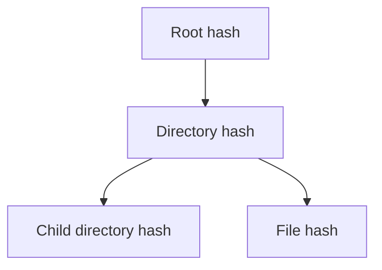

# Codebase Intelligence

Treat the repository as a **software system graph**, not a pile of files and not a directory tree drawn with ASCII characters.

The goal is to let any coding agent answer, quickly and with evidence:

- Where is this behavior implemented?
- What symbols/files depend on it?
- What does this change potentially break?
- Which tests exercise the affected area?
- Which subsystem owns this responsibility?
- What are the important entry points and high-centrality modules?
- What changed since the previous index?

## Implementation contract (verified against `scripts/codegraph.py`)

This skill describes both a target-quality workflow and the repository's current
portable implementation. Keep those layers distinct.

The current implementation:

- indexes **Git-tracked files selected by its extension allow-list**; untracked
  files are not included unless a future scanner is used explicitly;
- stores its durable local index in `.code-intelligence/index.sqlite3` and writes
  `stats.json` and requested exports there;
- prefers Tree-sitter when `tree_sitter_language_pack` is installed and falls
  back to conservative regex extraction when it is unavailable;
- uses an mtime/size fast path during normal indexing. `index --force` is the
  content-authoritative verification path and rechecks every eligible file;
- exposes only the CLI commands implemented by the script: `index`, `report`,
  `query`, `path`, `stats`, and `export`;
- provides file-level dependency edges plus symbol records. Compiler-grade
  LSP/SCIP resolution, FTS5 retrieval, runtime architecture edges, and MCP
  integration are optional capabilities, not claims about the current script.

Whenever this document says “should”, “target”, or “prefer”, do not report that
behavior as already implemented unless the script, database, or an installed
adapter provides direct evidence. Label findings as `observed`, `inferred`,
`planned`, or `unavailable`.

## Non-negotiable principles

1. **No ASCII dependency maps.** Do not represent architecture with hand-written `├──`, `└──`, box-drawing trees, or giant text diagrams. Use structured graph data, ASTs, Mermaid, DOT, JSON, SQLite, or rendered graph tooling.
2. **Syntax before prose.** Prefer Tree-sitter ASTs/queries over regex for definitions, imports, declarations, calls, and references.
3. **Semantic precision when available.** Tree-sitter is syntax-oriented. For compiler-accurate definitions/references, prefer an available LSP, SCIP index, compiler index, or language-native resolver and merge it into the graph.
4. **Incremental by default.** Do not rescan every file merely because one file changed. The current script uses size + mtime as a fast path and can miss an edit that preserves both values; use `index --force` when content-authoritative verification is required. A target implementation should use content hashes and update only affected records and dependent relationships.
5. **Durable local cache.** Keep index metadata and hashes in a project-local SQLite database, normally under `.code-intelligence/`.
6. **Bounded context.** Agents should retrieve focused neighborhoods and evidence, not dump the entire repository into context.
7. **Evidence over guesses.** Every important graph edge should record how it was derived: AST query, import resolver, LSP/SCIP, heuristic, or external-tool result.
8. **Fail soft.** Unsupported languages or parse failures should degrade to file-level indexing and be reported; do not fabricate semantic edges.
9. **Respect repository boundaries.** The current script starts from `git ls-files`, so it excludes ordinary untracked/ignored files but can still include a tracked generated file or tracked secret. Inspect the tracked inventory, explicit exclusions, generated-file conventions, vendor/build directories, symlinks, and secret patterns before indexing or exporting.
10. **Keep the index disposable.** The source of truth is the repository; `.code-intelligence/` is a rebuildable acceleration layer and should normally be gitignored.

## Recommended architecture

Use five related layers rather than one overloaded graph:

### 1. Source/file layer

Nodes:

- file
- directory/package/module
- generated/external/vendor marker

Edges:

- contains
- imports
- exports
- includes
- references-file

### 2. Syntax layer

Store or derive AST information with Tree-sitter:

- node type
- byte/line range
- parent/child relationship
- named nodes
- parse-error regions

Do not persist entire ASTs unless there is a demonstrated performance need. Persist stable identifiers and enough ranges/types to reconstruct focused views.

### 3. Symbol layer

Nodes:

- module/namespace
- class/type
- function/method
- variable/constant
- field/property
- enum/trait/interface
- route/command/event where the language/framework makes these first-class

Edges:

- defines
- contains-symbol
- extends/implements
- calls
- reads
- writes
- references
- overrides
- instantiates

Each symbol should have a stable key such as:

`<workspace-relative-path>#<qualified-symbol-name>#<kind>`

Use source ranges to disambiguate overloads and local symbols when necessary.

### 4. Runtime/architecture layer

Add higher-level edges only when backed by evidence:

- HTTP route -> handler
- CLI command -> handler
- queue/topic -> consumer
- event -> publisher/subscriber
- database model -> migration/table
- dependency-injection binding -> consumer
- configuration key -> reader
- feature flag -> guarded code

These are framework-specific and should live in optional adapters, not in the universal extractor.

### 5. Analysis layer

Derived metrics include:

- in/out degree
- weighted degree
- betweenness centrality where useful
- PageRank for structural importance
- strongly connected components
- dependency depth
- change propagation neighborhoods
- test coverage relationships when coverage data is available

Use NetworkX locally for these analyses unless the repository size makes another graph engine materially necessary.

## Extraction workflow

### Step 0 — Establish repository boundaries

Before indexing:

1. Detect repository root with Git.
2. Read `.gitignore`, common generated/build directories, and the script's tracked-file allow-list.
3. Detect nested repositories/worktrees.
4. Classify files by language and role.
5. Record exclusions explicitly in the index metadata or run report. If the current implementation cannot record a category, say so instead of implying it did.

Do not follow arbitrary symlinks outside the repository unless explicitly configured.

### Step 1 — Detect changes

For each eligible file, compute:

- SHA-256 content hash
- size
- modification time as a cheap pre-check only
- language
- parser version / grammar identifier

The content hash is authoritative when computed. In the current script, unchanged
mtime + size can skip hashing; `--force` is required to remove that ambiguity.

Use a two-level change strategy:

1. Metadata pre-check: size + mtime.
2. Hash only when metadata changed or an explicit reindex is requested.

Never assume mtime alone means the content changed.

### Step 2 — Parse changed source files

Use the current Tree-sitter Python stack when available. Prefer:

```text
pip install tree-sitter tree-sitter-language-pack networkx
```

`py-tree-sitter-languages` / `tree_sitter_languages` is a legacy fallback only; it is currently documented by its own repository as unmaintained.

With `tree-sitter-language-pack`, prefer its public `get_parser(language)` API.

Example pattern:

```python
from tree_sitter_language_pack import get_parser

parser = get_parser("python")
tree = parser.parse(source_bytes)
root = tree.root_node
```

Use Tree-sitter queries or structured node walks to extract definitions, declarations, imports, calls, assignments, and obvious references. In the current implementation, coverage and parse-error persistence are limited; verify the extractor and report fallback/unsupported languages explicitly.

### Step 3 — Resolve semantics

Tree-sitter syntax does not by itself establish full symbol identity in every language.

Use this resolution order:

1. compiler/indexer/native semantic information when cheaply available;
2. SCIP index data;
3. language-server information;
4. framework-aware resolver;
5. conservative local heuristics.

Tag every edge with `resolution_method` and `confidence` when the active extractor
actually supplies those fields. Do not invent provenance for rows that only have
file, target, or lexical evidence.

Never promote a heuristic match to compiler-grade precision.

### Step 4 — Update the local index transactionally

Use SQLite in WAL mode.

Target-quality tables include:

- `files`
- `symbols`
- `edges`
- `parse_runs`
- `languages`
- `metadata`
- `errors`

The current SQLite schema is smaller and may use `defs`, `refs`, and `imports`
instead of the target names above. Treat the live schema as authoritative for
what was actually indexed; do not claim parse-status/error ranges if they were
not persisted.

At minimum:

```text
files(path, sha256, size, mtime_ns, language, status, indexed_at)
symbols(id, file_id, stable_key, kind, name, qualified_name, start_line, start_col, end_line, end_col)
edges(id, src_id, dst_id, kind, resolution_method, confidence, source_line, metadata_json)
```

For file-to-file edges, either use synthetic file symbols or a separate `file_edges` table.

When replacing a changed file in a target implementation:

1. begin transaction;
2. delete that file's old syntax-derived symbols and outgoing edges;
3. insert the new symbols/edges;
4. update its hash and parse metadata;
5. invalidate only affected derived metrics;
6. commit.

For deleted files, remove their records and edges and then repair any dangling references.

### Step 5 — Maintain dependency deltas

A changed file affects more than its own node when its exported/public symbols change.

Track at least:

- direct importers
- direct imports
- files referencing changed exported symbols
- test files associated with changed modules
- framework registration points when known

Start with the changed file and expand only through relevant reverse edges.

### Step 6 — Run graph analysis

For file dependency analysis, build a directed graph:

```text
G = (files, imports/includes/references)
```

Useful calculations:

- PageRank: structurally influential files/modules
- SCCs: cycles and tightly coupled regions
- shortest paths: dependency chains
- neighborhood expansion: likely impact set
- centrality: architectural hotspots

Do not call PageRank an architectural truth. It is a graph metric whose interpretation depends on edge selection and weighting.

### Step 7 — Produce agent-facing views

Never dump the entire graph by default.

Produce bounded, queryable views such as:

```json
{
  "query": "authentication middleware",
  "entry_points": ["src/auth/middleware.py"],
  "definitions": [],
  "dependencies": [],
  "dependents": [],
  "related_tests": [],
  "high_centrality_neighbors": [],
  "evidence": []
}
```

The current script does not implement the following names as CLI commands:

`map repository`, `map file`, `impact`, `trace`, `cycles`, and `related tests`
are target capabilities. Implement them as adapters or queries before telling an
agent they are available. Today use `report`, `query`, `path`, and `stats`.

## Current limitations and required honesty

The following are known gaps in the portable script and must be visible in any
review or handoff:

- the Merkle root is recomputed for the run; it is not currently used to prune
  parsing through a persisted subtree-delta structure;
- normal indexing can trust mtime + size, so same-metadata edits require
  `index --force` for certainty;
- parse errors, file status, parser versions, and error ranges are not all
  persisted in the current schema;
- import-resolution provenance is not guaranteed on every raw import row;
- `pathspec` is listed as an install dependency but is not currently used by the
  portable script;
- untracked-file indexing, LSP/SCIP resolution, FTS5 retrieval, runtime
  architecture adapters, and machine-readable query views beyond the existing
  CLI outputs are future work unless an adapter is present.

Do not describe any of these as completed capabilities. Record the limitation,
the evidence, and the proposed owner/issue when it affects a design decision.

## Merkle / incremental indexing design

A full Merkle tree is useful when change detection must aggregate directory/subtree state. It is not mandatory for every small repository.

Use this hierarchy (render it as a graph when a visual is needed):



A directory hash should be deterministic, for example:

`SHA256(sorted(child_name + child_hash + child_type))`

The root hash is then a compact snapshot of repository content state.

For a target implementation, pair this with the SQLite `files.sha256` table. In
the current script, the root is a run-level integrity value and the practical
incremental decision is still the mtime/size fast path (or full `--force` run).

Do not hash ignored/generated content unless the project explicitly wants it indexed.

## Dependency invalidation

Not all changes have the same radius.

### Text-only/local implementation change

Normally invalidate:

- changed file AST/symbol records
- metrics involving the changed nodes
- local callers/tests used by the task

### Exported symbol signature change

Also invalidate:

- direct importers/references
- callers
- related tests
- downstream package summaries

### Rename/move/delete

Run reference resolution across the affected namespace or use compiler/LSP/SCIP information.

### Configuration/schema change

Use framework adapters to expand the impact set. Examples include environment-variable readers, API schemas, database migrations, generated clients, and route registries.

## Handling multiple languages

Keep the universal pipeline language-neutral and isolate language-specific behavior in adapters:

```text
adapters/
  python/
  typescript/
  javascript/
  rust/
  go/
  java/
  csharp/
  cpp/
  shell/
```

Each adapter should define:

- filename/language detection
- parser name
- key AST node kinds
- definition queries
- import/reference queries
- optional semantic resolver
- framework hooks
- tests for extraction accuracy

Prefer data-driven Tree-sitter queries over large language-specific Python walkers where practical.

## Precision ladder

Label outputs using a visible confidence tier:

```text
A = compiler/LSP/SCIP-backed semantic edge
B = deterministic Tree-sitter + language rules
C = framework-aware heuristic
D = lexical/text heuristic
```

When a higher-confidence source conflicts with a lower-confidence source, prefer the higher-confidence source and retain provenance.

## Performance targets

The implementation should aim for:

- fast startup with an existing index;
- zero work for unchanged files after metadata pre-checks;
- O(changed files + affected relationships) normal edit processing;
- bounded query results;
- SQLite transactions rather than rewriting monolithic JSON indexes;
- parser reuse within a process;
- lazy graph materialization where the repository is large.

Do not optimize prematurely. Measure indexing time, files/sec, changed-files/sec, query latency, index size, and false-edge rate.

## Safety and correctness

Never:

- execute repository code merely to understand its static structure unless the task specifically requires it;
- trust generated code as source-of-truth without labeling it;
- leak secrets found during indexing into logs or graph metadata;
- recursively index `.git`, virtualenvs, package caches, build output, or dependency directories by default;
- invent references because two identifiers have the same spelling.

When parsing fails, a target implementation should preserve:

```text
file status = parse_error
error byte/line range
parser/language
message
```

A parse-error file may still retain file-level dependency metadata obtained by
safer mechanisms. The current script may fall back without persisting the full
status/range record; report that limitation.

## When not to use this skill

Do not build/rebuild a full repository graph for trivial changes that can be answered from one known file. Use the smallest sufficient analysis.

For a repository-wide architectural task, migration, refactor, debugging investigation, or unfamiliar codebase, activate this skill early.

## Understanding and spec work

Structural analysis answers where behavior lives and what a change touches; it does not decide what should change. When a task changes behavior, feed the findings into the project's requirement and decision records where the project keeps them, and follow its spec workflow: understand → requirement/decision → plan → implement → verify. If code and the recorded spec disagree, report the conflict rather than implementing around it.

## Deliverables for repository work

When this skill materially contributes to a coding task, leave behind:

1. a disposable local index under `.code-intelligence/`;
2. a concise machine-readable status/manifest when the implementation supports
   it (the portable script currently writes `stats.json`, not a full manifest);
3. queryable graph data rather than hand-drawn ASCII maps;
4. enough provenance to explain important edges;
5. updated tests for new extraction rules or resolvers.

See `references/reference-architecture.md` for the data model, `references/retrieval.md`
for the query/fusion protocol, `references/graph-schema.md` for the node/edge vocabulary
and confidence bands, `references/providers.md` for the preferred/optional/fallback
matrix, `references/understanding-artifacts.md` for the `docs/codebase/` contract,
`references/security.md` for exclusion and redaction rules,
`references/understanding-pipeline.md` for the layered pipeline overview, and
`scripts/codegraph.py` for the portable implementation.

## Local invocation

From the repository root:

```bash
python3 -m pip install -r .agents/skills/codebase-intelligence/requirements.txt

python3 .agents/skills/codebase-intelligence/scripts/codegraph.py index
python3 .agents/skills/codebase-intelligence/scripts/codegraph.py report --top 20
python3 .agents/skills/codebase-intelligence/scripts/codegraph.py query "<symbol>" --refs
python3 .agents/skills/codebase-intelligence/scripts/codegraph.py path <from> <to>
python3 .agents/skills/codebase-intelligence/scripts/codegraph.py stats
python3 .agents/skills/codebase-intelligence/scripts/codegraph.py export --format json
```

`--root` is a global option and must precede the subcommand; it defaults to the current
directory, so it may be omitted when you are already at the repository root. Use
`index --force` after parser/schema changes, when mtime/size may be unreliable, or
when a review needs content-authoritative evidence. `path` and GraphML export
require NetworkX. The index is written under `.code-intelligence/` and is
gitignored; never stage that directory.

## Change and review protocol

For unfamiliar or repository-wide work:

1. Read repository instructions and check Git status before indexing.
2. Run a normal `index`, then inspect `stats` and `report`.
3. Confirm the tracked-file boundary and look for tracked secrets/generated files.
4. Query only the symbols/files needed for the current question.
5. Use `index --force` when parser, grammar, schema, or same-metadata edits make
   the fast path insufficient.
6. Preserve evidence with the command, timestamp, index root, extractor, and
   confidence tier.
7. Feed architectural findings into the repository's requirements/decision/TODO
   process; the graph is evidence, not a substitute for product decisions.
8. Run `git diff --check` and verify that local indexes and credentials remain
   untracked.
