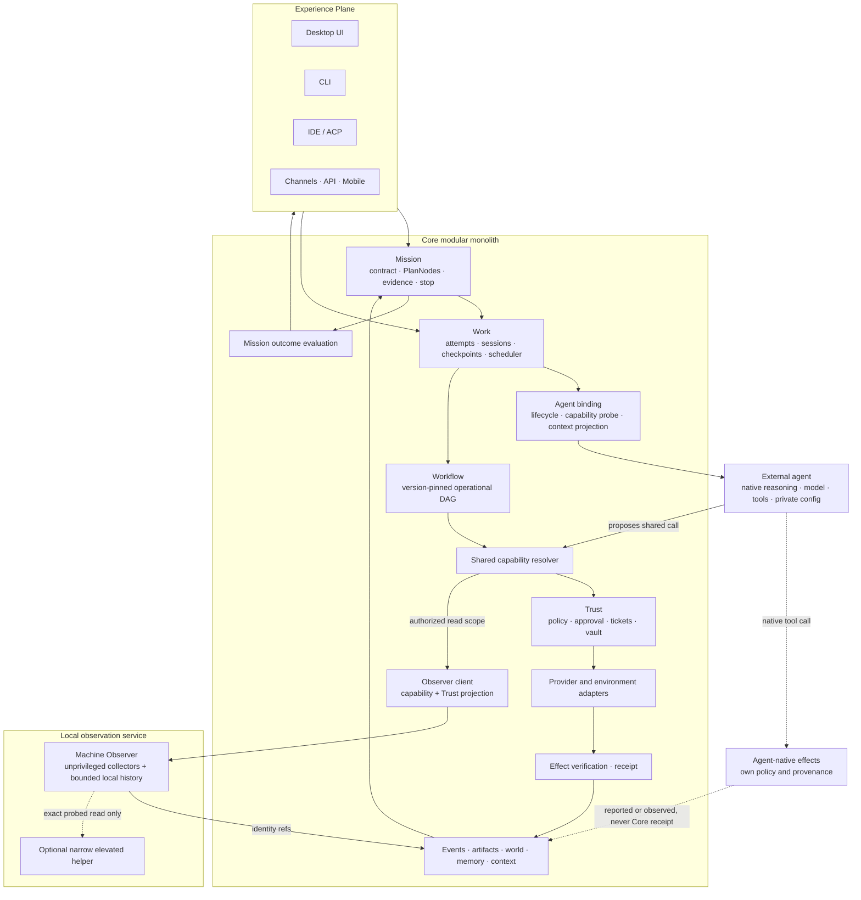
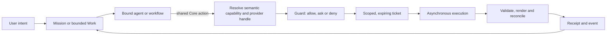

# 03 — High-Level Architecture (HLD)

> **Status:** Frozen v1 baseline, amended by DEC-054/055/056/057/058/059/060/061/062/063/064/065 (2026-09-29) — architecture root for **HOW** (see `ARCH/00-INDEX.md` §2). Module docs derive from this file; conflicts escalate to a `DEC` entry.
> **Companion docs:** `ARCH/02-THESIS.md` (identity, principles) · `ARCH/06-DATA-MODEL.md` (entities) · `ARCH/07-CONTRACTS.md` (interfaces) · `ARCH/48-EXPERIENCE-SURFACES.md` (final UX HLD/LLD) · `ARCH/50-SYSTEM-BLUEPRINT.md` (amended whole-system maps) · `ARCH/51-MACHINE-OBSERVABILITY.md` (local observer service).
> **SDD:** this doc is the L2 architecture layer — it satisfies behaviors registered in `ARCH/08-REQUIREMENTS.md` and must not contradict them; module → REQ traceability accrues in `ARCH/09-FEATURE-MATRIX.md`.
> **Fleshed:** P7 (2026-09-26) — contract index (§3.1), failure model (§11), non-functional envelope (§12).
> **P9 verification pass (2026-09-26):** read line-by-line; fixes applied where needed (owner-directed; re-freeze follows).

## 1. Shape

> **DEC-054/055/056/057/058/059/060/061/062/063/064/065 amendment (2026-09-29):** Mission owns durable goals; Work owns execution attempts; the selected external agent owns its native reasoning loop, model, tools and private configuration. Core governs and receipts only shared Core capability calls; native agent effects remain under their own policy and distinct provenance (DEC-063). Workflow trigger ownership is fenced across local/cloud handoff and does not promise exactly-once external effects. Suitable structured API/connector/MCP/CLI paths precede target-specific browser or OS accessibility; vision and raw input remain fallbacks (DEC-060). `48` owns the nontechnical-first surface and truthful active-work projection; `50` maps whole-system ownership, and `51` adds local machine telemetry without expanding the World Model. DEC-062 makes queued chat payloads durable independently of binding and resolves the latest valid conversation selection at dequeue, with no silent fallback. DEC-064 adds a lazy, scoped host skill catalog and exact-version artifact result links. DEC-065 defines read-only work visualization; continuous surface streaming remains deferred behind separate authorization and a new contract if later justified.

*The diagram shows primary flow, not every edge. The authoritative edge list is the module map (§3) plus each module doc's contract section.*

## 2. Planes — ownership boundaries

| Plane | Owns | Never owns |
|---|---|---|
| Experience | Rendering, input, presentation, view state | Domain logic, execution, policy |
| Mission | Versioned goal contracts, semantic PlanNodes, requirement/evidence truth, replanning and stop | Agent turn reasoning, Work scheduling, native agent tools |
| Work | Lifecycle, checkpoints, scheduling, budgets, cancellation | Reasoning, execution |
| Agent binding | Adapter normalizes lifecycle and handoffs; the external agent owns reasoning, turn context, native planning/tools/model calls | Core capability implementation or Core policy; Core does not own the agent's native internals |
| Workflow | Reusable, version-pinned operational graph, triggers and waits | Mission goal/requirement truth or native agent reasoning |
| Capability | Semantic operation catalog, resolution, handles, affordances, guidance | Model reasoning |
| Trust / Control | Policy, permissions, approvals, tickets, egress, custody (vault), audit | Domain logic |
| Execution | Running provider calls, environments, sandbox, process lifecycle | Deciding *whether* to run |
| Domain Runtimes | Office / Browser / Computer / Files / Code specialized execution | Agent reasoning, governance |
| Effect Verification | Validate / render / verify / reconcile effects | Deciding what to build |
| Receipts & Events | Durable evidence, replay, audit, projections | Live execution |
| World Model *(cross-cutting)* | Structural state of the machine + change stream | Acting on the world |
| Machine Observer | Current measurements, provider status and bounded local metric history | World identity, file traversal, machine mutation, Core policy |
| Model Plane | Model catalog, routing, adapter normalization; credential **use** via vault | Holding credentials (vault owns custody) |

## 3. Module map

> `Depends on` lists primary dependencies. Every edge MUST have a named contract in `ARCH/07-CONTRACTS.md` (P1) or the owning module doc.

| Doc | Module | Responsibility | Depends on |
|---|---|---|---|
| 10 | Kernel | ids, errors, config, time, serialization, contracts | — |
| 11 | Work | Work/Step/Task/Session/Run/Checkpoint/Scheduler; lanes (foreground/background/detached) | kernel |
| 12 | Trust | Policy, Guard, approvals, tickets, vault, egress, audit hooks, external-agent projections | kernel, work |
| 13 | Capability | Registry, catalog, resolver, handles (epoch-checked), affordances, guidance | kernel, work, providers, trust |
| 14 | Providers | `ProviderAdapter` contract + native/MCP/ACP/HTTP/CLI/plugin/remote adapters; MCP era policy | kernel, trust, runtime-environments |
| 15 | Agent plane | The `AgentEngine` contract every agent implements, plus delegation + subagent lifecycle, isolation modes and receipts | work, context, memory, capability, models, runtime-environments |
| 16 | Context | Context infrastructure (Core: store/query/snapshot/checkpoint) + context control (the bound engine) + projections | kernel, files, world-model, memory, artifacts |
| 17 | Memory | Durable memory: layers, write/read paths, minimal algorithm set, lifecycle | kernel, events |
| 18 | Models | Model registry, router, adapters, local discovery (Ollama/LM Studio/vLLM/llama.cpp), reasoning mapping | kernel, trust (vault) |
| 19 | Runtime & Environments | Process manager, environments, sandbox, lifecycle, health | kernel, trust |
| 20 | Workflow | Workflow IR, registry, scheduler, state/version store, approval nodes | work, capability, agent runtime, events, world-model |
| 21 | World Model | Scanner, app/window/process/device/BrowserWorld/FileWorld registries, world graph, event stream, incremental updates | kernel, events, domain collectors |
| 22 | Office | L1/L2/L3 semantics, resident contexts, batch, render/validate, format providers | capability, providers, runtime-environments, trust |
| 23 | Browser | Managed Chromium + adapters, BrowserWorld, capability ladder rungs | capability, providers, world-model |
| 24 | Computer Use | UI automation, accessibility trees, vision fallback, input safety | world-model, capability, models (vision) |
| 25 | Files | File identity, watchers, deltas, leases (write conflicts) | kernel, events |
| 26 | Code | RepoGraph, RepoMap, LSP bridge, worktrees, code execution | files, capability, runtime-environments |
| 27 | Search | Search plane (files, memory, artifacts, world objects) | files, memory, artifacts, world-model |
| 28 | Comms | Connectors: email/calendar/messaging as capability layer | capability, providers, trust |
| 29 | Artifacts | Artifact + Receipt models, versions, provenance, previews, library promotion | kernel, files, events |
| 30 | Events | Event store, bus, replay, subscriptions; usage & cost telemetry | kernel |
| 31 | Skills & Plugins | Skill registry/loader/resolver; plugin surfaces (capabilities, providers, agents, models, channels, UI) | capability, work, trust |
| 32 | Channels | Surfaces & protocols: desktop, CLI, ACP, A2A, API, mobile; agent gateway | everything above (thin) |
| 34 | Effect Verification | Validate/render/verify/reconcile pipeline; receipt policy per risk | domains, artifacts, events |
| 35 | Mission | Versioned goal/requirements, adaptive PlanNodes, semantic readiness, team and candidate-comparison dispatch through Work | work, context, artifacts, events, outcome |
| 36 | Outcome & Recovery | Requirement evidence evaluation, drift reconciliation, recovery ladder and stop | mission, work, artifacts, runtime, effect verification |
| 37 | Workflow–Skill Lifecycle | Capture, proposal, evaluation and promotion; external workflow adapters | workflow, skills, trust, eval |
| 38 | Experience Quality | Progressive Mission Control, transparency and quality measurement | channels, mission, evidence |
| 46 | Ecosystem HLD | Native-vs-shared ownership, scoped extensions, heterogeneous teams and bounded same-task comparison | agent, capability, trust, channels, mission, work |
| 48 | Experience surfaces | Composer, progressive Workbench, Library, settings, agents/team/Compare/attention panels | channels, mission, work, artifacts, ecosystem |
| 50 | System blueprint | Cross-plane Mermaid ownership and lifecycle maps (navigation only) | module contracts |
| 51 | Machine Observer | Read-only machine telemetry/history service; independent build and local protocol | runtime, trust, capability, world, files |
| 40–42 | Cross | Flows, edge cases, evidence map | all |
| 43 | Glossary | Canonical terms — defined once, linked back (meta) | — |
| 44 | Absorb Register | Competitor absorb matrix + licensing ledger | archive/REPO-COMPARE evidence |

### 3.1 Contract index (module → owned contracts)

Every cross-module edge is named in `ARCH/07-CONTRACTS.md`. A module with no owned contract exposes only capability descriptors through CTR-009 until its module pass registers one.

| Module (doc) | Owned contracts |
|---|---|
| Kernel (10) | — (types, ids, errors only) |
| Work (11) | CTR-003 `WorkService` · CTR-004 `SessionLog` · CTR-026 `Scheduler` |
| Trust (12) | CTR-011 `Guard` · CTR-012 `ApprovalService` · CTR-013 `Vault` |
| Capability (13) | CTR-009 `CapabilityBroker` |
| Providers (14) | CTR-010 `ProviderAdapter` |
| Agent plane (15) | CTR-001 `AgentEngine` · CTR-002 `AgentSession` · CTR-007 `ContextController` · CTR-021 `DelegationService` · CTR-030 `AgentBindingAdapter` |
| Context (16) | CTR-005 `CheckpointService` · CTR-006 `ContextProvider` |
| Memory (17) | CTR-008 `MemoryService` |
| Models (18) | CTR-014 `ModelRouter` / `ModelAdapter` |
| Runtime & Environments (19) | CTR-015 `EnvironmentService` |
| Workflow (20) | CTR-016 `WorkflowEngine` · CTR-031 `ExternalWorkflowAdapter` |
| World Model (21) | CTR-017 `WorldService` |
| Office (22) · Browser (23) · Computer Use (24) | — (capability descriptors through CTR-009; a named contract is registered only for a non-capability edge) |
| Files (25) | CTR-024 `FileIdentity` / `WorkspaceWatcher` / `WriteLeases` |
| Code (26) | CTR-025 `RepoIntelligence` |
| Search (27) | — (implements the Core search service behind `CTR-006 context.search`; capability descriptors through CTR-009) |
| Comms (28) | — (capability descriptors through CTR-009) |
| Artifacts (29) | CTR-018 `ArtifactService` / `ReceiptService` |
| Events (30) | CTR-019 `EventBus` / `EventStore` |
| Skills & Plugins (31) | CTR-020 `SkillResolver` |
| Channels (32) | CTR-022 `AgentGateway` |
| Effect Verification (34) | CTR-023 `EffectVerifier` |
| Mission (35) | CTR-027 `MissionService` (contract, plan, dispatch, reconcile) |
| Outcome & Recovery (36) | CTR-028 `OutcomeEvaluator` · CTR-029 `MissionRecovery` |
| Workflow–Skill Lifecycle (37) | — (lifecycle composes CTR-016/020/031; no second workflow adapter) |
| Experience settings (48) | CTR-032 `PreferenceService` |
| Cross (40–42) · Register (44) | — |

## 4. Dependency rules

1. **Ownership follows named contracts:** Experience → Mission or bounded Work → agent binding/workflow → shared Capability → Trust → provider/effect verification. Events, artifacts, memory and world are shared substrates with explicit read/write contracts; Mission consumes their projections. External agents remain outside Core.
2. **Kernel stays small.** No domain logic, no orchestration, no policy in the kernel.
3. **One owner per responsibility.** Mission owns semantic planning; Work owns execution admission; Workflow owns version-pinned operational graphs. Do not duplicate any of their schedulers, registries, provider systems or permission systems — including “temporary” ones.
4. **Adapters at the edge.** MCP/ACP/CLI/HTTP/remote live only in Providers/Channels; nothing above Capability knows the transport.
5. **Domains never govern themselves.** Domain runtimes execute; Trust decides; the kernel never special-cases a domain's permission path.
6. **External agents are clients of the public contract** — they MUST NOT be given internal module access to make integration easier.

## 5. The governed execution path

The cached, guarded **control path** targets p50 < 2 ms, p95 < 10 ms and p99 < 25 ms; the effect path is asynchronous and observable. These targets exclude an external agent's native tool path.

- **No shortcuts within Core.** A shared Core capability cannot bypass Guard through an MCP, UI, domain or adapter. An external agent may use its own native tools under its own policy; those effects receive native provenance, never a Core receipt (DEC-054).
- **Verification depth scales with risk class** (`safe` / `sensitive` / `dangerous`) — defined in `ARCH/34-EFFECT-VERIFICATION.md`.
- **Receipts are mandatory for Core-mediated externally visible effects.**

## 6. Scoping model

**Four states** — applied to MCP servers, skills, plugins, providers, models alike:

| State | Question | Example |
|---|---|---|
| Installed | Does AgentCowork have this at all? | GitHub MCP server installed |
| Available | Can this agent/workspace use it? | Workspace policy allows it |
| Activated | Is it loaded for this task? | Only relevant skills load into context |
| Executing | Is it running right now? | An actual tool call / session / worker |

**Five scopes** (outer → inner): **Global/User → Workspace/Project → Agent → Session → Run/Task.**
These states/scopes govern **host-owned** resources. Installation/catalog visibility may be Global or Workspace; effective grants and activation are resolved per binding, Session and Work. A discovered agent's native extensions stay in its own configuration and policy domain (`46`); the host may show a read-only inventory but does not merge those resources into a global grant.

## 7. Cross-cutting subsystems

- **Context** (`16`): Core owns infrastructure (store/query/snapshot/checkpoint/projection); the bound engine owns control (selection/ranking/budget/prune/compact/rebuild). External agents get a **context projection**, never the substrate.
- **Memory** (`17`): durable knowledge; written via explicit lifecycle (not an LLM dumping everything); read through the Context Controller under budget. Memory ≠ context.
- **World Model** (`21`): the machine explains itself — registries + graph + event stream; consumers query, they do not screenshot by default.
- **Events** (`30`): one event store; UI projections, workflow triggers, world updates, audit, and usage/cost telemetry all derive from it.
- **Artifacts & Receipts** (`29`): outputs of work vs reusable inventory (Library); promotion is explicit.
- **Model Plane** (`18`): one catalog/router for Core-owned model consumers and explicit agent bindings that support host model selection. A discovered agent can retain its own model configuration and native provider path (`46`).

## 8. Module interop matrix (first cut — expanded per module in P2/P3, verified in P6; re-verified in P9)

| Module | Exposes (primary) | Consumed by |
|---|---|---|
| Kernel | types, ids, errors, config | all |
| Work | Work service, lanes, checkpoints | agents, workflows, UI, scheduler consumers |
| Mission | contract/plan versions, PlanNode readiness, outcome status | Experience, Work dispatcher, evidence and recovery |
| Trust | Guard decisions, tickets, approvals, projections | capability, providers, channels, domains |
| Capability | resolve/invoke, handles, descriptors | agents, workflows, UI (deterministic ops) |
| Providers | adapter registry, health, events | capability |
| Agent plane (15) | `AgentEngine` contract + `DelegationService`, CLI and ACP surfaces | work, channels, delegation |
| Context | query/snapshot/checkpoint + projection | agents, workflow nodes |
| Memory | memory service (write/read/forget) | agents, context |
| Models | registry, router, adapters | agents, vision, embeddings |
| Runtime & Environments | environment handles, process/sandbox lifecycle | providers, domains |
| Workflow | engine, registry, run state | agent tool surface, schedulers |
| World Model | world query/subscribe | context, workflows, domains, UI |
| Domains | capability descriptors + execution | capability |
| Artifacts | artifact/receipt service | agents, workflows, UI, library |
| Events | store/bus/replay/subscriptions | everyone (read/subscribe) |
| Skills & Plugins | skill resolver, plugin surfaces | capability, work, agents |
| Channels | Agent Gateway, surface mappings | external agents, UI/CLI/IDE |
| Verification | validated effects + render/verify results | capability (pre-receipt) |

## 9. Implementation order

`ARCH/39-ARCHITECTURE-DELIVERY.md` and `TODO.md` own the ordered implementation plan. The dependency sequence is: stabilize shared Work/Trust/capability/event/artifact contracts; bind and probe external agents without replacing their native loop; add Mission atop Work; complete Office/browser/desktop/files/connected-app capability providers; deliver the progressive Experience surfaces; then extend durable remote/cloud handoff and cross-device channels. Each stage must demonstrate its user-facing acceptance criteria before being called delivered. Horizon Code is a future external binding, not a Core reasoning engine (DEC-052/054).

## 10. Architecture risks to resolve in module passes

| ID | Risk | Resolved in |
|---|---|---|
| RISK-001 | Control-path latency targets depend on handle caching + ticket reuse; needs a design that keeps Guard cheap without weakening it. | 12, 13 |
| RISK-002 | World Model scope creep (scanning everything) vs value; incremental updates must be provably bounded. | 21 |
| RISK-003 | Workflow durability parity with established runtimes (timers, versioning, cancellation) without adopting one wholesale. | 20 |
| RISK-004 | Office resident contexts — memory/lifecycle bounds and crash safety. | 22 |
| RISK-005 | External-agent projection fidelity: enough context to work, not enough to leak. | 12, 16, 32 |
| RISK-006 | Memory minimalism: retrieval quality with a small algorithm set. | 17 |
| RISK-007 | Provider adapter counting: capability × provider matrix stays declarative, not hand-maintained. | 13, 14 |

## 11. Failure, recovery, and degradation

The architecture fails **closed** at Core trust boundaries and **honestly** everywhere else: no component fabricates state to hide a failure, and no Core-mediated failure path bypasses Guard (INV-01, INV-05, DEC-054). External-agent native effects are outside that guarantee.

| Failure | Architectural behaviour | Owner |
|---|---|---|
| Guard unavailable / cannot decide | DENY — effects never execute on a missing decision; no fallback path exists | 12 |
| Vault unavailable | Credential *use* fails closed; no plaintext fallback, no cached secret | 12 |
| Provider down / degraded | Health flips; the resolver may select another provider, otherwise a typed `Unavailable`; executed effects are not silently retried | 13, 14 |
| Execution crashes mid-effect | Effect state is reconciled at next start; where the outcome cannot be determined, the receipt records uncertainty rather than claiming success | 19, 34 |
| Domain runtime crash (Office/Browser/CUA) | Host survives; the provider epoch bumps, invalidating stale handles (DM-012, `13` §4); resident contexts are bounded and released | 22–24 |
| Agent run crashes | Work is marked failed with its last checkpoint retained; host and other sessions are unaffected | 11, 15 |
| Workflow runner restarts | Runs resume from checkpoints against their pinned definition version (INV-16) | 20 |
| World scanner lags | Consumers see `freshness` stamps and must tolerate staleness — never fabricate live state | 21 |
| Event store temporarily unavailable | Producers/consumers surface the gap and mark projections stale; no shadow state is created (INV-23) | 30 |
| Memory unavailable | Runs degrade to stateless context — memory is an addition, never a blocker for execution | 17 |
| UI disconnects | The cockpit re-derives its view from projections on reconnect; no UI-held state is treated as truth | 32 |

## 12. Non-functional envelope

| Axis | Envelope |
|---|---|
| Control-path latency | p50 < 2 ms · p95 < 10 ms · p99 < 25 ms for the guarded resolution path (SPEC §4); the effect path is asynchronous and observable |
| Token discipline | Deterministic operations never call a model (P-14, INV-13); context assembly is budgeted and honest about spend (INV-22) |
| Platform | Windows is the first release target; macOS/Linux are hosted targets; no design may assume a POSIX-only primitive (`ARCH/19-RUNTIME-ENVIRONMENTS.md`) |
| Resource isolation | Kernel stays minimal (INV-14); domain runtimes and sandboxed execution carry their own bounds; a failing domain cannot take down the host |
| Durability | Work, checkpoints, receipts and events survive restart; runs are pinned to versions (INV-16, INV-18) |
| Security | One Core authorization decider and egress path, vault custody (INV-02/04/05); every Core-mediated externally visible effect is auditable (INV-24); native-agent effects carry separate provenance (DEC-054) |
| Observability | One Core event log; usage/cost telemetry derives from it; every Core-mediated effect has a receipt (INV-07/23); native effects are reported or observed only |
| Verification | Depth scales with risk class (`ARCH/34-EFFECT-VERIFICATION.md`); "implemented" ≠ "verified" (SPEC §13) |
