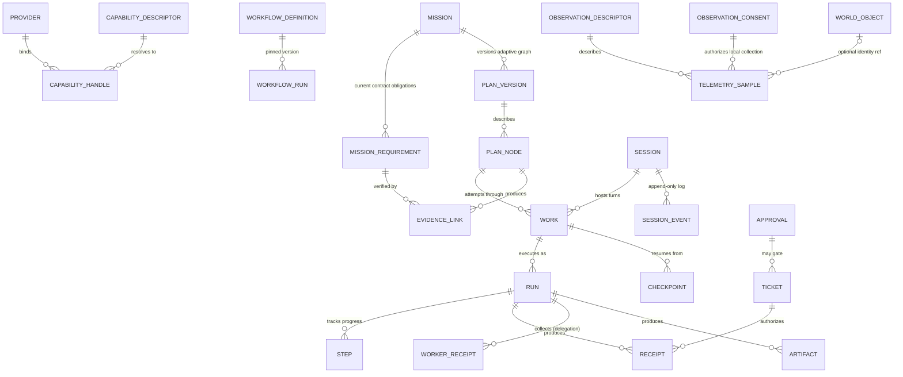

# 06 — Data Model (canonical entity registry)

> **Status:** Frozen v1 (frozen 2026-09-26; drafted P1). This is the **entity registry**: one canonical identity per shared entity, with one owner doc each. Module docs carry detailed schemas; this doc owns identity strategy, shared field rules, state-machine naming, and cross-entity constraints. Where this doc and a module doc disagree on naming/identity, **this doc wins**; on field detail, the owner doc wins.
> **Evidence:** product-owner brief schemas · `ARCH/15-AGENT-PLANE.md`, `ARCH/16-CONTEXT.md`, `ARCH/17-MEMORY.md` · `ARCHIVE/v1-research/agent-harness-verification.md` (receipt/limit shapes) · entity shapes cross-checked against `ARCH/12-TRUST.md`/`13`/`14`/`20` during the P7 module passes.
> **P9 verification pass (2026-09-26):** read line-by-line; fixes applied where needed (owner-directed; re-freeze follows).

## 0. Conventions

- **IDs:** uuidv7 (time-ordered) for entities; capability ids are dotted semantic names (`office.spreadsheet.edit`); provider ids are stable registry ids. IDs are opaque — never encode state or meaning.
- **Time:** integer epoch milliseconds (UTC) internally; ISO-8601 at boundaries. Local wall-clock time is **never** a durable field.
- **One writer** per entity store (INV-06). Cross-store changes happen via contracts + events, never by shared writes.
- **Immutability classes:**
  - *immutable:* `Event`, `SessionEvent`, `Receipt`, artifact **versions**, `Checkpoint`, workflow **versions**, `WorkerReceipt`.
  - *mutable-with-audit:* `Work`, `Run`, `Step`, `Session`, `WorkflowRun`, `Approval` state transitions.
  - *hard-delete allowed:* `MemoryItem` (explicit forget → suppression record, DEC-018); everything else tombstones + audit.
- **Secrets:** no entity ever stores a credential value — vault references only (INV-02).
- **Sensitivity:** entities that can carry user content have `sensitivity: public | personal | confidential` (default `personal`); this is the **only** sensitivity vocabulary (`normal`/`sensitive` are not sensitivity classes — risk classes are a separate scale); memory carries its own class rules and the assignment/floor rule (`17`, DEC-038).
- **Versioning:** any entity that can be referenced by a running execution (workflow, capability, skill, agent) is content-versioned; runs record the version they started with (INV-16).

## 1. Registry

| DM | Entity | Owner doc | Purpose | Key states |
|---|---|---|---|---|
| DM-001 | `Work` | `11` | Universal execution unit (chat turn, job, workflow run, subagent task, automation) | queued → running → waiting/paused/awaiting_approval → completed/failed/cancelled/expired |
| DM-002 | `Step` | `11` | Unit of progress inside a run | pending → active → done/failed/skipped |
| DM-003 | `Task` | `11` | **Projection** over `Work` + `Step` + assignment metadata — not a standalone durable table (`11` §2) | derived (open → claimed → done/blocked/cancelled) |
| DM-004 | `Session` | `11` | Durable conversation/agent-context container | active → hibernated → archived |
| DM-005 | `Run` | `11` | One concrete execution of an agent (or workflow node) | started → streaming → waiting → terminal |
| DM-006 | `Checkpoint` | `16` (stored `11`) | Durable state-reconstruction point (work · context · workflow) | immutable |
| DM-007 | `SessionEvent` | `11` | Append-only session log entry (the log is truth; UI/prompt/pending are projections) | immutable |
| DM-008 | `Event` | `30` | System-wide published fact (triggers, projections, telemetry, audit feed) | immutable |
| DM-009 | `Ticket` | `12` | Scoped, time-boxed authorization for one effect | issued → used → expired/revoked |
| DM-010 | `Approval` | `12` | Human decision record (agent question · workflow approval node) | requested → granted/denied/edited/expired |
| DM-011 | `CapabilityDescriptor` | `13` | Semantic operation definition | versioned |
| DM-012 | `CapabilityHandle` | `13` | Resolved provider binding (epoch-checked) | valid → stale (epoch bump) → expired |
| DM-013 | `ProviderInfo` | `14` | Provider registration + health | registered → connected → degraded → down |
| DM-014 | `AgentProfile` | `15` | Agent definition (native or external); incl. composer capabilities; occupancy facts stay distinct (`installed` ≠ `discovered` ≠ `launchable` — REQ-UI-011) | installed / discovered / launchable / available / disabled |
| DM-015 | `DelegationPolicyEntry` | `15` | Worker configuration for delegation | versioned |
| DM-016 | `WorkerReceipt` | `15` | Result summary returned to the parent (never the transcript) | immutable |
| DM-017 | `ContextItem` | `16` | Context fragment record (reference-first) | ephemeral |
| DM-018 | `MemoryItem` | `17` | Durable memory atom | current → superseded; forgotten (suppressed) |
| DM-019 | `Artifact` | `29` | Versioned work product | created → versions (immutable) → archived |
| DM-020 | `Receipt` | `29` | Durable evidence of one externally visible effect | immutable |
| DM-021 | `WorkflowDefinition` | `20` | Deterministic process IR | draft → published (versioned) |
| DM-022 | `WorkflowRun` | `20` | Workflow execution record | queued → running → waiting/paused/awaiting_approval/retrying → completed/failed/cancelled/expired |
| DM-023 | `LibraryItem` | `29` | Reusable inventory entry (explicit promotion only) | active → deprecated |
| DM-024 | `Workspace` | `25` | Scope anchor (folder/repo/multi-root) + project identity | — |
| DM-025 | `ModelDescriptor` | `18` | Model capabilities/pricing/limits registry entry | versioned by provider |
| DM-026 | `WorldObject` (+`WorldEdge`) | `21` | Structural world state + relationships | ephemeral with freshness stamps |
| DM-027 | `Skill` | `31` | Reusable know-how package (instructions + capability requirements) | versioned |
| DM-028 | `Mission` | `35` | Durable user outcome above Work | draft → active/waiting/paused/verifying → terminal |
| DM-029 | `GoalContractVersion` | `35` | Immutable user intent, criteria, constraints and budgets | immutable |
| DM-030 | `MissionRequirement` | `35` | Individually addressable acceptance obligation | unplanned → verified/partial/blocked/superseded |
| DM-031 | `Milestone` | `35` | Semantic grouping and gate | proposed → active → completed/invalidated |
| DM-032 | `PlanVersion` | `35` | Immutable adaptive graph version | immutable |
| DM-033 | `AssumptionRecord` | `35` | Provenance-bearing inferred premise | unverified → verified/invalidated |
| DM-034 | `DecisionRecord` | `35` | Rationale and supersession of consequential choice | proposed → committed/superseded |
| DM-035 | `EvidenceLink` | `36` | Requirement/node/claim to artifact/receipt/verification with validity | current → stale/invalid |
| DM-036 | `OutcomeEvaluation` | `36` | Independent requirement and mission result | immutable versioned result |
| DM-037 | `ExtensionGrant` | `46` | Explicit binding/workspace/Work activation of host MCP/skill/plugin component | active → revoked/expired |
| DM-038 | `PlanNode` | `35` | Durable semantic unit whose Work attempts can be replaced; may pin a bounded candidate-comparison strategy without introducing another queue | proposed → ready/running/verifying → completed/invalidated/superseded |
| DM-039 | `AgentBinding` | `15` | One actual profile/launch/session capability negotiation with provenance | discovered → negotiated → attached → detached |
| DM-040 | `SettingsProfile` | `48` | Named, versioned non-secret preference overrides with typed scope and effective-state preview | draft → active/archived |

| DM-041 | ObservationDescriptor | 51 | Metric/provider capability, units, source, availability and required scope | available/stale/unsupported/permission_needed/disabled/error |
| DM-042 | TelemetrySample | 51 | Local bounded time-series observation linked to an optional stable World identity | append-only until retention pruning |
| DM-043 | ObservationConsent | 12 | Revocable local-user permission to collect a named observation category for a stated purpose and retention | enabled → revoked/superseded |

### 1.1 Core relationships (load-bearing references)

*Association lines show load-bearing references, not every field. Epoch checks, projections, and suppression semantics live in the owner docs and §3.*

## 2. Shared field blocks (cross-cutting entities)

> Detailed SQL/TS lives in owner docs; these are the load-bearing shared fields.

**DM-001 `Work`** — `id` · `kind` (`session_turn` | `job` | `workflow_run` | `subagent_task` | `automation`) · `status` · `parent_work_id?` · `mission_id?` · `plan_node_id?` · `attempt_number?` · `session_id?` · `agent_id?` · `workspace_id` · `objective` · `priority` · `completion_contract_ref?` · `budget {tokens, cost, time}` · `checkpoint_ref?` · `created/started/finished`.
**DM-004 `Session`** — `id` · `workspace_id` · `agent_binding` (the bound engine, of any kind) · `status` · `title` · `parent_session_id?` · `fork_origin_ref?` (message/checkpoint and source version) · `log_range` (SessionEvent span) · `retention_class` · `last_active`. A fork can exist without Work; lineage survives archival and points to an unavailable source when retention or scope prevents opening it (DEC-056).
**DM-005 `Run`** — `id` · `session_id` · `work_id` · `agent_id` · `model` · `reasoning_level` · `status` · `usage {in,out,cost}` · `receipt_refs[]`.
**DM-006 `Checkpoint`** — `id` · `scope` · `kind` (`work` | `context` | `workflow` | `session`) · `content_ref` · `reconstructable` (produced deterministically vs model-written) · `version`.
**DM-009 `Ticket`** — `id` · `capability_id` · `provider_id` · `environment_id` · `provider_epoch` · `scope` (paths/targets/resource patterns) · `issued_at` · `expires_at` · `uses` · `approval_ref?`.
**DM-011 `CapabilityDescriptor`** — `id` · `version` · `description` · `affordances[]` · `requirements[]` · `providers[]` · `loading_mode` (`eager|catalog|on-demand`) · `risk_class` (`safe|sensitive|dangerous`) · `auth_requirements?` · `verification`.
**DM-012 `CapabilityHandle`** — `capability_id` · `provider_id` · `provider_epoch` · `environment_id` · `permission_snapshot` · `runtime_handle_ref` · `expires_at`.
**DM-014 `AgentProfile`** — `id` · `name` · `runtime` (`native|acp|cli|mcp-agent|remote`; `native` is a legacy descriptor, not a first-party reasoning engine) · `version` · `status` (`installed` · `discovered` · `launchable` · `available` · `disabled`) · `provenance` · `executable_or_endpoint_fingerprint` · `supported_models[]` · `declared_capabilities[]` · `protocol` · `supports_subagents/background/steering` · `composer` capabilities; native config locations are metadata only.
**DM-039 `AgentBinding`** — `id` · `profile_id` · `launch_profile_ref` · `protocol_version` · `negotiated_capabilities[]` (declaration/probe/observation/timestamp) · `governance_class` · `session_ref?` · `attachment_state` · `extension_grant_refs[]` · `fingerprint`.
**DM-015 `DelegationPolicyEntry`** — `worker_agent_id` · `role` · `model?` · `instructions_ref?` · `skills[]` · `mcp_scope[]` · `permissions` · `workspace_scope` (`shared|isolated-worktree|sandbox`) · `can_spawn_children` · `max_parallel` · `max_turns?` · `token_budget?` · `mode` (`automatic|preferred|manual|disabled`) · `routing_rules[]`.
**DM-016 `WorkerReceipt`** — `agent_id` · `run_id` · `plan_node_ref?` · `requirement_refs?[]` · `evidence_refs?[]` · `assumption_proposals?[]` · `decision_proposals?[]` · `status` · `scope[]` · `summary` · `findings?[]` · `changed_files?[]` · `tests?[]` · `artifacts?[]` · `blockers?[]` · `confidence?` · `usage {in,out}` · `will_wake?` (advisory, from the `subagent.finished` event) · `partial?` (set when the child overran its step budget or was interrupted mid-task).
**DM-017 `ContextItem`** — see `16` §2 (id · source · type · content_ref · token_cost · priority · relevance · freshness · scope · pinned · compressible · reconstructable · sensitivity).
**DM-018 `MemoryItem`** — see `17` §3 (full SQL): scope/kind/content/hash/dedup_key/sensitivity/trust_tier/source/confidence/pinned/used/superseded_by/expiry.
**DM-019 `Artifact`** — `id` · `name` · `type` · `mime_type` · `source` (`agent|workflow|user|worker`, producer identity) · `origin` (`generated|uploaded|imported|linked`, Library filter) · owner refs (`session_id/run_id/workflow_id/agent_id/workspace_id/mission_id/plan_node_id`) · `version` · `location` · `provenance` (chain) · `parent_artifact?` · `input_version_refs[]` · `downstream_refs[]` · `validation_state` · `dependency_state` (`current|stale|invalid|superseded`) · `extraction/index_state` · `permissions` (DEC-054/055).
**DM-020 `Receipt`** — `id` · `effect_ref` · `ticket_ref` · `capability_id`/`provider_id` · `inputs_digest` · `outputs` · `verification` (what ran) · `status` · `work_id` · `timestamps`.
**DM-021 `WorkflowDefinition`** — `id` · `version` · `trigger` · `inputs/outputs` · `nodes[]`/`edges[]` (typed) · `variables` · `secrets[]` (vault refs) · `retry/timeout/concurrency policies` · `compensation?`.
**DM-022 `WorkflowRun`** — `run_id` · `workflow_id` + `workflow_version` · `status` (enum above) · `current_node` · `variables` · `completed_nodes[]`/`pending_nodes[]` · `waiting_until?` · `checkpoints[]` · `artifacts[]` · `approvals[]` · `errors[]` · `retry_state`.
**DM-023 `LibraryItem`** — `id` · `kind` (`agent|skill|workflow|connector|plugin|template|prompt|saved_artifact`) · `name` · `description` · `saved_from_artifact_id?` · `version` · `usage_count` · `origin` (`generated|uploaded|imported|linked`) · `active_artifact_version_ref?` · `permissions_ref` · `index_state` · `created_at/updated_at`. The user-facing Library is a permitted composite query over Artifact/File entries plus explicitly promoted reusable LibraryItems; showing an indexed upload does not silently promote it to a reusable item (DEC-014/055).
**DM-024 `Workspace`** — `id` · `kind` (`folder|repo|multi-root`) · `roots[]` · `project_identity` (stable repo identity; DEC-040, shared with OQ-FILES-01) · `policy_refs[]` · `trust_level`.
**DM-025 `ModelDescriptor`** — `id` (`provider/model`) · `provider` · `context_window` · `max_output` · `tool_calling` · `reasoning_modes[]` · `vision` · `streaming` · `structured_output` · `cost {in,out}` · `latency_class` · `local|cloud`.
**DM-026 `WorldObject` / `WorldEdge`** — `id` · `kind` (`app|window|file|process|device|browser_tab|…`) · `identity_key` (per-kind stable key) · `attributes` · `freshness` · `provenance`; edges: `kind` · `from` · `to` · `observed_at`.
**DM-027 `Skill`** — `id` · `version` · `metadata` · `instructions_ref` · `capability_requirements[]` · `input/output contracts` · `examples_refs[]`.
**DM-043 `ObservationConsent`** — `id` · `subject_user` · `category` · `purpose` · `local_recipient` · `scope` (`on_demand|foreground_live|background_history`) · `sampling_policy` (cadence, active condition, foreground/background) · `retention_policy` · `policy_version` · `granted_at` · `revoked_at?` · `source_surface`. Trust owns this local, persistent, revocable product consent for Machine Observer collection only. Basic live readings are sampled only on demand or while the System Workbench is open. Continuing collection after it closes requires a separate history/background grant with its own cadence and retention. It does not authorize agent disclosure, a Core capability call, or OS elevation; agent sharing still needs its Work-scoped capability grant, and any privileged helper authorization is one operation and ephemeral.

ObservationDescriptor fields: metric identity, category, provider id/version, unit, sensitivity, platform/device scope, availability state, permission class, refresh interval, observed time, staleness limit and an optional reason. It describes availability; it is not authorization.

TelemetrySample fields: sample id, metric id, observed time, typed value, unit, optional World identity ref (process/device/volume), provider/version, quality, `observation_consent_ref`, optional Work ref and retention class. Samples live in the Observer's bounded local telemetry store, never as one Core event per sample.

## 3. Cross-entity constraints

Observer samples contain no credentials, process command lines, prompt/completion content or network payload; access and retention derive from the referenced Trust consent and current Work-scoped sharing authorization. High-frequency samples are not emitted as Core Event entities (DEC-058, INV-36/37).

1. Every **Core effect** `Receipt` references exactly one `Ticket` and one effect; every Core-mediated externally visible effect has a receipt (INV-07, DEC-054). Native-agent observations and reports are distinct evidence types.
2. Every effect-bearing `Event` references its `work_id`; every `Work` outcome emits ≥1 event.
3. `Artifact` versions are immutable; provenance chains are append-only; Library promotion is explicit (DEC-014).
4. `CapabilityHandle` validity is `provider_epoch`-checked (DM-012, `13` §4); handles never survive a provider restart.
5. `SessionEvent.seq` is monotonic per session; the log is append-only and is the source of all session projections (DEC-027).
6. `WorkflowRun` executes against the `WorkflowDefinition` version it started with (INV-16).
7. `Approval` decisions are recorded once and referenced by receipts/tickets; they are never inferred.
8. No entity stores secrets; sensitivity filters apply before any cross-scope read (INV-10).
9. `MemoryItem` is the only entity with hard-delete; deletion writes a suppression record (DEC-018) whose digest is keyed and whose erasure policy is declared (DEC-039).
10. Cross-store references are by id + ref only — never by embedding another entity's mutable state.
11. Memory mutations split by class (DEC-042): **in-store writes** (extract · remember · forget/supersede/pin/edit · wipe) are local persistent mutations — policy-gated per scope + audited, no per-write ticket; **boundary-crossing operations** (export/import to disk, sharing) follow the governed effect path. Permitted scopes and sensitivity ceilings are actor-derived, never caller-supplied (`17` §4/§9).

## 4. Open questions (`OQ-DM-*`)

1. **Resolved (`11` §2, v1; DEC-054 amendment):** `Task` remains a projection over `Work` + `Step` + assignment metadata. Cross-work semantic planning uses the new `PlanNode` (DM-038), a distinct entity, not a redefinition of `Task`.
2. `WorldObject.identity_key` per kind (file identity rules live in `25`).
3. **Resolved (`16` §2, v1):** `ContextItem` is ephemeral and reference-first — never durable state.
4. `SessionEvent` vs `Event` boundary: confirm which event classes are session-local vs published (`11`/`30`).
5. Library template semantics vs versioned item (ties `29`).
6. Session retention classes and hibernation policy (`11`).

## 5. Evidence

Owner brief schemas (Work/Workflow/Artifact/AgentProfile/DelegationPolicy/WorkerReceipt/CapabilityDescriptor/CapabilityHandle/ProviderAdapter) · `ARCH/15-AGENT-PLANE.md` §2/§7 · `ARCH/16-CONTEXT.md` §2/§3 · `ARCH/17-MEMORY.md` §3 · `ARCHIVE/v1-research/agent-harness-verification.md` §A1–A2 (budgets), §A3–B3 (subagent model), §C1–C2 (log/projection), §D1 (handle/registry/inbox).

## 6. Related

- `ARCH/08-REQUIREMENTS.md` — the behaviors these entities serve; `ARCH/09-FEATURE-MATRIX.md` — REQ → entity/owner traceability.
- `ARCH/07-CONTRACTS.md` — the interfaces by which entities are observed and mutated (projections and refs only).
