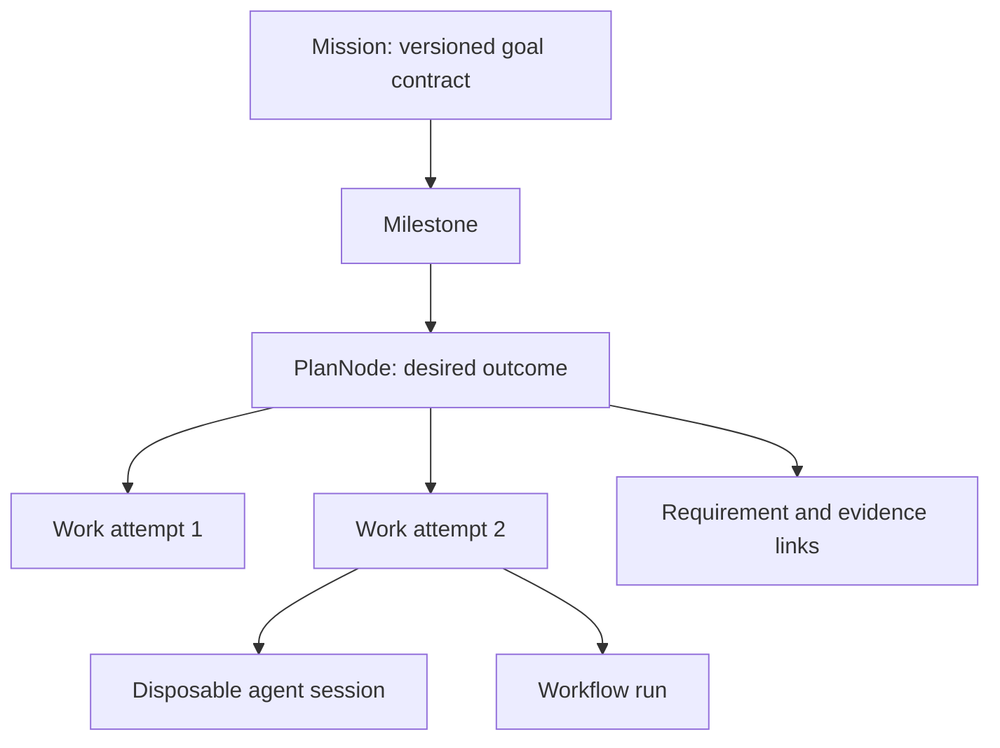

# 35 — Mission plane

> Status: accepted target architecture 2026-09-28 under DEC-054; implementation pending. Owner: new `agentcowork-mission` module in the existing modular monolith. This is the durable semantic layer above `11-WORK`; it does not own an agent's reasoning loop or a second execution scheduler.

## Purpose and boundaries

`Mission` records the user's outcome across minutes or months. `PlanNode` records a semantic unit of the plan; `Work` records an execution attempt. One node may have several Work attempts. `Session` is a disposable agent context. `Step` is a Work progress boundary. Simple chat need not materialize a full Mission graph; substantial, recurring, risky or long-running goals do. A user may explicitly promote a chat to a mission. Mission and Work use the same event store, identity, budget accounting and one Work scheduler. Mission readiness is a projection/dispatcher, not a competing job queue.

## Canonical records

All records carry stable ID, schema version, `workspace_id`, creation/update timestamps and event sequence. Sensitive bodies are encrypted or referenced by content-addressed artifacts according to `12-TRUST`; event payloads are redacted. The event log plus versioned records is truth; progress, status lists and UI percentages are projections.

| Record | Required fields | Invariant |
|---|---|---|
| `Mission` | id, owner, status, current_contract_version, current_plan_version, budget_ref, policy_profile_ref, created/updated/settled | A Work failure never implies Mission failure. |
| `GoalContractVersion` | mission, version, original user text ref, objective, constraints, non_goals, success criteria, required evidence, approval rules, budget, author/source, supersedes, digest | Immutable after commit; human changes create a new version. |
| `MissionRequirement` | id, contract version, statement, acceptance predicates, importance, source, status, evidence refs, supersedes | Important requirements individually addressable; `verified` requires evidence. |
| `Milestone` | id, mission, objective, ordering/dependencies, status | Container and gate, not execution. |
| `PlanVersion` | version, base version, graph digest, author/proposer, reason, evidence refs | Committed atomically; compare-and-swap against base version. |
| `PlanNode` | id, milestone, type, objective, input refs, requirement refs, completion contract, required evidence, risk, priority, budget ceiling, dependencies, status, attempt Work refs, output/evidence refs, invalidation/supersession | Semantic identity survives retries and worker replacement. |
| `AssumptionRecord` | statement, source, confidence, impact if false, status, evidence, affected nodes, supersedes | Inferred claims never silently become facts. |
| `DecisionRecord` | decision, rationale, alternatives, evidence, affected nodes, authority, supersedes | Proposed agent decisions are distinct from committed user/Core decisions. |
| `EvidenceLink` | requirement/node/claim, artifact or receipt ref, verifier, timestamp, environment fingerprint, validity | Invalidation propagates when an input/assumption changes. |

Node types: research, agent_task, workflow, capability_action, integration, verification, human_gate, wait, decision, artifact. The graph is acyclic for scheduling; loops are represented by new versions/attempts, not back-edges. States: proposed, waiting_dependency, ready, claimed, running, waiting_user, blocked, verifying, completed, retrying, failed, cancelled, superseded, invalidated. Mission states: draft, active, waiting_user, paused, blocked, verifying, completed, completed_partial, failed, cancelled, archived. Terminal reasons are typed and recorded. `invalidated` means previously valid evidence no longer establishes the current contract, not that historical work never occurred.

## Controller and transactions

Agents may submit `PlanPatch { mission_id, base_plan_version, add/change/supersede_nodes, add/remove_edges, reason, evidence_refs }`. Mission validates graph acyclicity, actor scope, contract constraints, node ownership, budgets, policy and stale base version; it commits a new PlanVersion and events atomically or returns a typed conflict. No agent directly updates Mission tables. Requirement or contract changes produce an impact set: affected nodes, dependent nodes, artifacts and evidence. Recheck changed external facts before invalidation. Affected completed nodes become `invalidated`; unaffected nodes retain their status. Active Work receives a versioned steer or is interrupted at a safe boundary.

The Goal Keeper is a bounded check inside Mission: compare candidate action/node against contract and non-goals at plan commit, dispatch and outcome review. Deterministic checks run first; a semantic evaluator may flag possible drift but does not acquire policy authority. It should not poll every tool call or rewrite the agent's plan. The user can override an interpretation by versioning the contract.

Ready nodes are computed from the committed graph and latest evidence. Mission dispatch creates Work with `mission_id`, `plan_node_id`, `attempt_number` and a context-packet reference, then the existing Work scheduler admits it. Work terminal events feed node acceptance; agent-reported success alone cannot complete the node. Mission may keep independent branches running when one node waits for user input. Budget ceilings are hierarchical maxima (Mission → node → Work); no double-counting. For local desktop execution, a single host can own the dispatcher; remote/multi-host workers later require leases and heartbeat/reconciliation, never an assumed exactly-once guarantee.

### Storage and crash boundary

The first implementation uses the existing Core SQLite/event-store ownership pattern. `mission` stores stable identity and latest committed version references; `goal_contract_version` and `plan_version` are append-only, unique on `(mission_id, version)`; `plan_node_version` is unique on `(mission_id, plan_version, node_id)`; `mission_requirement`, `assumption`, `decision` and `evidence_link` have their own stable IDs and version/status events. Foreign keys constrain references **within the Mission store**; Workspace, Work and Artifact references across owner stores are validated through their contracts and reconciled from events, never by cross-store writes. Index `(mission_id, status, priority)` for ready projection and `(mission_id, plan_version)` for graph loading; Work owns uniqueness of `(plan_node_id, attempt_number)` for attempts. Bodies and evidence artifacts stay reference-first; no duplicate transcript or blob in the Mission tables. Schema migration follows the repository's forward-only, idempotent convention with backup/recovery before destructive transitions; no ad hoc JSON file becomes a second source of truth.

Contract/plan commits transact version row, changed node/requirement rows and event/outbox records together. Readiness is a rebuildable projection with a cursor over the one event log. Dispatch uses an idempotency key `(mission_id, plan_node_id, attempt_number)`; a transactional outbox requests Work creation, and recovery reconciles a pending outbox against an existing Work with that key before retrying. This avoids a crash between “node claimed” and “Work created” producing duplicate attempts. A node is marked running only after a Work-created acknowledgement. Completion similarly records Work result and node-acceptance decision as separate events, so the verifier can reject a worker result without losing it. Lock or compare-and-swap on `(mission_id, current_plan_version)` serializes plan commits; a stale planner never overwrites a newer graph.

The Mission controller reads dependency closure and evidence validity to choose ready nodes. It does **not** poll every agent step, run a second timer heap, or maintain a second execution queue. Work/Workflow own timers, process liveness and step retries; Mission reacts to their settled events and to contract/input changes. A Mission-level scheduled review is itself one Work/Workflow occurrence. The Mission event stream includes `mission.created/paused/resumed/settled`, `contract.versioned`, `requirement.*`, `plan.versioned`, `node.ready/dispatched/accepted/invalidated`, `assumption.*`, `decision.*`, `evidence.linked/invalidated`, and `outcome.evaluated`; payloads carry IDs/digests and redacted summaries, not credentials.

## Recovery, stopping and truth

At each dispatch and meaningful boundary, persist a **cognitive checkpoint** (contract/plan/node, decisions, assumptions, findings, remaining work) and an **execution reference** (workspace/branch/dirty hash, process/runtime image, browser profile ref, connector epochs, artifact versions). Session transcripts are optional evidence, never needed to reconstruct Mission truth. Resume first compares environment fingerprint and current external resources; it may invalidate affected nodes and request replanning before further mutation. An offline local host remains paused; cloud work continues only when an explicitly configured cloud executor owns the Work and credentials/scopes.

Typed failures choose bounded recovery: transient tool retry; rate limit wait or provider alternative; context failure fresh session; environment failure restore or reconstruct; implementation failure diagnostic/replan; permission wait; external drift invalidate; irreversible unknown effect `needs_attention`. Attempt signatures include error fingerprint, tool strategy and material state delta. Same failure plus no new evidence stops repeat retries. Mission Stop Controller returns completed, completed_with_warnings, partial, waiting_user, blocked, budget_exhausted, no_progress or failed after checking required requirements, evidence, active children, unresolved assumptions and side effects. There is no numerical accuracy guarantee; proof coverage and outcome tests make reliability measurable.

## Interfaces

`MissionService` offers create/get, version_contract, propose/apply_plan_patch, ready_nodes, dispatch, reconcile, pause/resume/cancel, evaluate. `OutcomeEvaluator` returns a result per requirement (`pass`, `fail`, `partial`, `not_tested`, `blocked`, `superseded`) with evidence refs and independence level. `RecoveryCoordinator` chooses Work/session/node/milestone recovery without changing the engine's internal retry logic. `MissionProjection` serves UI/CLI/mobile and is rebuildable from events. Exact Rust signatures follow canonical types in `06` and contracts in `07`; no protocol-specific transcript appears in a canonical record.
