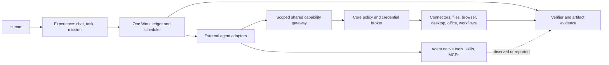

# 46 — Agent ecosystem architecture

> Status: accepted target architecture, 2026-09-28; implementation pending. DEC-054 in `04-DECISIONS.md` governs conflicts with the frozen v1 text. This document is the target HLD for external-agent coexistence, teams and shared capabilities. `15`, `31`, `32`, `12` and `20` own their detailed implementations.

## 1. Product contract and ownership

AgentCowork is the durable work environment around interchangeable external agents. A bound agent owns its reasoning loop, planner, model/provider choice, native tools, native subagents, native MCPs/skills/plugins and native session state. Core owns **its** Work ledger, shared capability catalog, mediated effect path, vault, policies for mediated calls, workflow scheduling, artifact lineage, verification and UI projections. Horizon Code is a future external binding under the same adapter contract; there is no first-party reasoning engine in this repository (DEC-052).

The previous absolute phrase “all agent effects go through Core” is false for a discovered self-contained agent. Core guarantees tickets, path/network checks, audit and verification for calls made through Core capabilities. For native calls it can record agent-reported progress/output and observed file changes, labelled `native_observed` or `agent_reported`, but must never claim a Core authorization, full trace or receipt it did not produce. An optional managed/mediated binding may enforce a stronger boundary through a separately verified adapter and environment; it may not silently replace a discovered agent's tools or configuration. All UI badges and evidence disclose which boundary was used.

The diagram distinguishes native and mediated paths. It does not promise an OS sandbox around arbitrary native agent actions.

## 2. Agent discovery, binding and adapter negotiation

`AgentProfile` (DM-014) describes install provenance (`discovered`, `host_installed`, `remote`), executable/endpoint fingerprint, protocol, availability, supported capabilities, native configuration locations (metadata only), health and capability evidence time. Discovery is read-only: PATH/known-location scan, bounded `--version` or equivalent probe, then a user-initiated test handshake. Cache results; re-probe on binary fingerprint/PATH changes; timeout or unknown means `unverified`, never “unsupported.” Do not copy credentials, inspect native private session files or rewrite native MCP/skill/plugin configuration. Installing a new engine may create a private AgentCowork-managed profile with explicit user review. A discovered agent keeps its profile; host additions use an ephemeral per-session overlay only where the protocol supports it. Unsupported injection is shown as unavailable, with a documented manual recipe; no silent global edit.

`AgentBinding` (DM-039) resolves an agent profile plus launch profile and negotiated `Capabilities`: ACP/A2A/CLI transport; resume/steer/cancel semantics; tool injection; MCP server list support; context limits; background availability; file/browser/desktop/git/vision support; native subagents; usage reporting; output schema. Capabilities have `declared`, `probed`, `observed` and timestamp fields. No generic adapter can promise methods the engine lacks. CLI fallback is a bounded subprocess, with explicit limits on steering and resume. Native and managed agent identity remain distinct in the UI even if they share a model.

`start`, `attach`, `send`, `steer`, `interrupt`, `cancel`, `status`, `checkpoint`, `result` and `capabilities` are adapter operations with typed `unsupported` responses. `spawnChild` is a **Work delegation operation**, not assumed to be a native subagent API. Native subagents can be observed when exposed, but cross-engine delegation is host Work. ACP is preferred where implemented; A2A/remote uses the same Work semantics without presuming ACP methods. Adapter version negotiation pins the protocol for each session.

### 2.1 One conversation, fast agent handoff

The user's conversation is a **logical host Session**; each selected agent has its own attached native session/reference beneath it. A picker change changes the binding for the next turn in the same visible conversation. It does not rewrite the previous agent's transcript, merge private memory, silently interrupt a running turn, or create a new conversation. A running turn remains owned by its original binding; the UI queues the new binding for the next turn or asks the user to stop/finish before switching.

To make switching fast, retain reusable attached-session handles per logical Session when the agent supports them, cache only non-secret capability/model/health metadata, and attach or start in parallel with rendering a small handoff preview. Avoid rediscovering or re-authenticating on each turn. An unavailable/expired binding receives a typed resume/re-auth state; do not block the composer while unrelated session history loads. There is no promise of zero-latency switching where a CLI must cold-start.

The receiving agent gets a bounded **handoff packet** built from the host-visible conversation: latest user goal/constraints, selected message range or concise handoff summary, explicit attachment/Library/Workbench refs and versions, current Mission/Work status, and any specifically activated host extensions it can actually consume. It does not receive the prior agent's hidden system prompt, private transcript, provider credentials, native MCP state, or private memory. User-visible transcript remains common and speaker/tool events retain the producing agent identity. Each turn snapshots binding/model/extension grants so later picker changes do not mutate past provenance.

An agent selection is allowed before the first turn and during an idle logical Session. If the new binding cannot accept one or more carried refs, the draft remains intact and the user sees the unsupported items before send. Active Mission replacement is a separate Work/PlanNode replacement decision under `35`/`36`; changing the conversation's next-turn agent does not steal active Mission Work.

## 3. Ownership and scope of MCP, skills and plugins

Four independent coordinates are recorded for each extension: **custodian** (agent-native / AgentCowork / third-party service), **installation location**, **visibility** (catalog scopes) and **activation grant** (specific Work/session/agent/action). A global catalog entry means discoverable metadata, never “started for every agent” or “authorized everywhere.” Default shared activation is one Work item and one agent binding, inherited by a child only through an explicit attenuated grant. Workspace/session/task-specific overlays can narrow but never widen a policy grant. Tool name collisions are namespaced by custodian/provider; the agent sees an explicit choice and no silent shadowing. Revocation invalidates active handles and next calls; in-flight semantics follow the existing ticket lease rules.

For each MCP server, persist `origin`, `owner`, `definition`, `transport`, requested permissions, credential reference, allowed principals/workspaces, startup policy, runtime instances, health, and effective grants. Resolve at session attach against a permission snapshot reference; launch lazily on first accepted use or proactively only when explicitly selected for that session. One authenticated server instance is not shared across users or trust scopes unless its isolation is proven. Existing native MCPs are shown as a **read-only inventory** if detection is supported; their effective permissions are governed by the native agent, and Core does not claim to revoke them. Host-owned MCPs pass through `agentcowork-mcp` and Core Trust. The Channel-B tool call must carry the real `session_id`, `agent_binding_id`, `work_id`, grant and trace id; the current hard-coded `channel-b`/`external` values in `src-tauri/src/channel_b.rs` are an implementation gap.

The effective host grant is the intersection of owner policy, user consent, workspace scope, Work scope, binding capability, extension manifest permission and any attenuated parent grant. A requested tool/action outside any one set is `DENY`; an absent grant is `DENY`, not a global fallback. Authentication scopes attach to the connector/action (for example Gmail read versus send), not merely to an entire Google account. Credential references are resolved by the Core broker only at a mediated call. Revocation bumps the grant epoch so cached tool handles fail on their next admission. Startup mode is `on_demand` by default; `prewarm` requires an explicitly selected scoped loadout. Health and restart budgets are per runtime instance, and a failed server degrades that capability without blocking unrelated agents. Native-agent servers are listed separately with `visibility=detected`, `grant=unknown/native`, never merged into host policy results.

Skills are procedural content; they cannot grant tools or permissions. A host skill has provenance, version, declared capability requirements, scope, activation state and evaluation status. A discovered native skill remains in the native agent's namespace. A plugin is a package manifest of selected skills, tools/MCPs, agents, workflow templates and UI contributions, each separately permissioned. Plugin install/enable is never a blanket grant to all of its components. Avoid copying a user's native plugins into the host. Any import is explicit, versioned and reversible.

### 3.1 How host extensions reach the selected agent

Installation in Core makes an extension available in the **host catalog only**. For each Work, resolve an explicit loadout from user selection/relevance, connector account and action scopes, current Trust policy, selected AgentBinding compatibility, Mission/workspace constraints and any attenuated parent grant. The resulting `ExtensionGrant` belongs to that exact binding + Work/session; siblings and later turns do not inherit it unless a new grant is resolved.

For a compatible agent, expose host capabilities through a session-scoped AgentCowork MCP façade (preferred) or a separately negotiated tool-injection surface. That façade advertises only the resolved tool subset and binds each invocation to the true session/binding/Work/grant/trace. Core's connector/provider executes it after Guard admission; the agent receives results, never OAuth/API secrets. Names are qualified (for example `cowork.google_mail.search` versus `native.gmail.search`) and UI activity identifies which provider actually ran. Do not mount every installed server into every agent by default.

AgentCowork also ships a small versioned read-only host skill catalog (`cowork/*`) available across projects and compatible bindings. Catalog availability is not prompt injection: only selected/relevant entries are loaded, and project pins/defaults remain distinct from per-Work activation. Before every binding switch, resolve compatibility and requirements again. Deliver bounded, version-pinned instructions only when that binding supports an explicit session skill/context overlay; otherwise keep the skill browsable as host guidance or use a supported host-side capability. Never install or synchronize these into a discovered agent's native directories. The catalog families and exact provider prerequisites are owned by `31` §2.1.

Host plugins resolve component-by-component: each MCP, skill, workflow, model adapter or UI surface has its own compatibility and grant state. A plugin is not injected as an opaque all-powerful bundle.

If the binding cannot accept a shared tool or instruction overlay, show `not available to this agent` with the reason and offer a compatible binding, a native setup link/recipe, or direct host execution as a separate user-directed Work. Never silently edit a discovered agent's config or claim the selected agent can use an extension it cannot see. This is the capability-negotiation boundary that makes agent switching honest and fast.

### 3.2 Connected apps and connector identity

Gmail, Google Drive/Sheets, Microsoft 365, Slack and similar services are host **connectors/capabilities**, not skills and not agent identities. Connection setup authorizes an account with Core-owned OAuth scopes and vault custody; per-Work tool activation narrows that account grant to operations such as `mail.search`, `mail.read`, `mail.draft` or `mail.send`. Search/read scopes do not imply send/write. The composer `+ Connect an app` flow establishes the account connection, while Agent/Work settings determine which allowed operations a specific worker can invoke. A host connector may itself be presented through the scoped MCP façade above.

If a native agent already has its own Google MCP/plugin/login, it remains a separate native path with its own credential owner and policy. It is listed as native/detected when observable and never merged with the host account or advertised as Core-governed. Duplicate service names are disambiguated by owner/account. User can pick the host account or the native agent path when both are eligible; the actual path and assurance are recorded.

### 3.3 Shared Extension Market

AgentCowork is a later client of the same product-neutral Shared Extension Market catalog first consumed by HorizonCode. Both clients read the same published catalog revision; AgentCowork does not run a second public-source crawl or fork the listing identity. The market covers four listing families: Connector/service, standalone MCP server, Agent Skills package, and plugin bundle. For a Connector, the market describes the service and provider offers; Core separately owns the user's account Connection, Vault credential reference, capability mapping, policy, and per-Work grant.

The shared broad-release goal is at least 500 unique, source-resolvable, type-qualified records, with 1,000 as the expansion target. The initial planning mix is 200 Connector/services, 150 MCP servers, 100 skills, and 50 plugins. These counts are measured against the same canonical catalog snapshot for both products; source mirrors, versions, provider alternatives, and nested plugin components do not count again. Product-specific relevance and compatibility are separate projections and do not change shared listing identity.

This distribution catalog is not the Core Capability Catalog (`13`), model/provider catalog (`14`/model plane), MCP runtime (`14`), or authorization system (`12`). It has no connection credentials, install state, grants, or execution authority. AgentCowork keeps local package inspection/install/activation under `31` and `12`, account setup under the existing connector and Vault owners, and all effects under Guard. Browsing the shared catalog is read-only. Remote community package installation and updates remain deferred until the trust and package-delivery gates in `31` are qualified.

## 4. Shared browser, desktop and SaaS plane

The agent may choose its own native path. Core advertises optional shared operations through negotiated ACP MCP server entries, MCP tool facades or adapter-supported tool injection, plus short task-specific instructions. No unconditional prompt ranking that forces shared office/browser/computer-use over native tools. The host recommendation ladder is structured API connector → site/native MCP → DOM browser → accessibility/desktop computer use → visual fallback, chosen by reliability, permissions and user preference. An engine may decline a shared tool; UI must show the path actually used.

For “find a YouTube video,” the task can use a suitable API/search connector, a user-owned browser session, or desktop Chrome with login handoff. Shared browser and desktop sessions need named ownership, profile isolation, user takeover, action preview for consequential submissions, observation receipts, and no password extraction. The capability is offered in a bounded loadout and discovered progressively rather than putting all tools in every prompt. Gmail/Drive/Sheets should use per-action OAuth scopes and a Core vault-backed connector where available; a separately installed CLI can be offered as an external adapter with its own credential custody disclosed.

## 5. Heterogeneous teams

The lead is an ordinary external agent selected by user or capability evidence. It proposes decomposition, worker selection and integration. Core validates task contracts, available agents, permissions, budgets and dependencies; creates child Work; schedules and records it. The lead retains intellectual coordination, while the Work scheduler supplies durable execution control. A Claude Code/Codex CLI lead can request an OpenCode, Cline, Gemini, Hermes, Horizon Code or local-model worker when an adapter exists and the negotiated capability set satisfies the child task. A worker can be chosen explicitly or by measured task profile; model name alone is not an eligibility test.

Each child receives objective, input refs, context packet, allowed resources, output contract, acceptance checks, deadline and budget. Its native tool system remains intact within its own environment. Shared grants are attenuated. Parallel writers get separate Git worktrees or artifact versions; shared browsers get explicit session lease or separate profiles. An event mailbox carries progress, questions, receipts and wake signals. Results return as typed receipts with confidence and evidence refs, then an integration phase checks compatibility. The parent is never asked to read every child transcript. A verifier independent of the worker checks consequential outcomes.

The Agent settings panel has an **Available as a subagent** toggle per installed/discovered binding (default off). Turning it on opens its delegation profile: permitted roles; selected model pin; inherited or custom bounded skills and MCP grant ceiling; workspace/isolation mode; concurrency/depth; and enable/disable state. The model list is queried from that binding's verified supported-model/configuration surface, not from a global model catalog. Selecting a model pins that exact provider-qualified model to calls where this profile is used as a host child. If the adapter cannot set or verify the model, the control is unavailable and the profile can only use `agent-managed` when the user explicitly permits that fallback; the UI never labels it as pinned.

The lead may choose either (a) **this same agent as a child**, with a fresh child session/context and a child-specific model override only if its adapter supports it, or (b) another enabled subagent binding. “Same agent” means same engine/profile, not reuse of the parent session or transcript. A child always has its own host Work and negotiated session. Agent-native subagents remain controlled by their native agent; the host toggle governs only whether this binding is eligible for host-created child Work. The enabled roster is user-configured, and the lead cannot expand it, turn on a disabled agent, change its pinned model, or widen its grants during execution.

OpenHands Agent Canvas reinforces the distinction between backend task tracking and launching a child conversation. Its child launch builds a self-contained brief, local execution prefers a worktree but can fall back to shared files, and the parent receives a launch result rather than a unified child stream or integration result. AgentCowork therefore treats launch as dispatch only: the child remains a Work with durable identity, lifecycle, scoped inputs, and result receipt; successful child completion still requires integration and mission-level verification. Source and limits: `ARCH/45-REFERENCE-RESEARCH.md` “OpenHands Agent Canvas,” especially [`child-conversation-launch.ts`](https://github.com/OpenHands/OpenHands/blob/f174ba8465233e46e66ab2c5667b358f1d6676d6/src/services/child-conversation-launch.ts) and [`launch-child-conversation-client-tool.ts`](https://github.com/OpenHands/OpenHands/blob/f174ba8465233e46e66ab2c5667b358f1d6676d6/src/api/launch-child-conversation-client-tool.ts).

### Compare approaches (bounded candidate fan-out)

“Compare approaches” runs the **same task** through two or more eligible agent/harness/model combinations; it is different from a team, where workers own different subtasks. The user starts it from the Agent picker's secondary action, may select compatible candidates or ask the app to suggest a diverse set, sees candidate count and budget before launch, and can cap concurrency. Mission stores one comparison PlanNode and dispatches ordinary Work attempts through the one Work scheduler. Every candidate gets the same immutable contract version, input/artifact versions, context baseline and acceptance criteria. Agent identity/harness/model are recorded as provenance, not treated as the quality score.

Writable isolation is claimed only if the negotiated binding can enforce a separate worktree or artifact version; otherwise that candidate must be read-only or excluded with the reason shown. Every candidate's native/Core capability loadout and effective policy are recorded; non-equivalent workers are labeled as worker-system comparisons, not model-only comparisons. Each candidate has bounded resources and may fail independently without erasing completed siblings. A shared evaluator compares criterion-level results, evidence, output quality, elapsed time and cost. The user selects a viable result or requests a separate integration Work; integration starts from a clean baseline and is verified again. Core-mediated browser, connector, desktop and other external effects remain preview/dry-run until selection and then use their ordinary per-effect Trust ticket/approval. Agent-native effects remain under the worker's own policy: Core cannot claim to suppress them, and opaque/unbounded native mutation policies are excluded from the default safe comparison unless the user separately reviews and accepts them before launch. No Core-mediated effect may auto-send, publish, deploy or merge merely because a candidate scored highest. This is not an unbounded swarm and adds no second task scheduler.

## 6. Reuse and restraint

Keep the existing Rust Work/Guard/MCP/ACP/Blueprint/Artifact building blocks. Do not create a second agent loop, scheduler, memory store, credential store or generic workflow engine. n8n and Activepieces are optional external **workflow providers** through versioned invoke/status/cancel/webhook adapters; their executions are represented by one host Work item and evidence refs. Their connector ecosystems should be used through sanctioned APIs/MCP/CLI where practical, rather than reimplementing hundreds of services. A local deterministic workflow remains in `20-WORKFLOW` for user tasks requiring host governance and offline operation. A provider-specific feature absent from the adapter remains provider-owned, not silently emulated.

## 7. Local and open-weight models

A model endpoint is not an agent. A local model becomes a team worker only when an external agent harness with the required tool, session and receipt contract binds to it. Otherwise it serves narrower roles such as classification, extraction, embeddings, reranking or draft review through the existing Model Plane. [llama.cpp's server](https://github.com/ggml-org/llama.cpp/blob/master/tools/server/README.md) and [vLLM's serving interface](https://github.com/vllm-project/vllm/blob/main/docs/serving/online_serving/README.md) expose compatible inference/tool interfaces, but actual tool-use reliability is model/template/hardware specific. The router therefore records measured capability for a **model + harness + hardware + tool loadout** tuple: structured-output validity, multi-step task completion, context fit, vision support, latency, memory use, cost and privacy locality. A cheap local worker can summarize sources or check a bounded artifact; a high-risk or complex task may require a stronger compatible worker. No provider swap silently changes the agent harness, permissions or evidence class.
