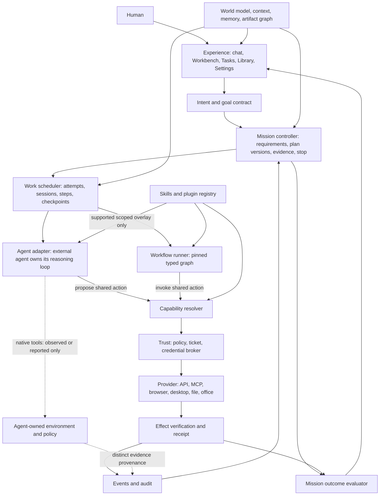
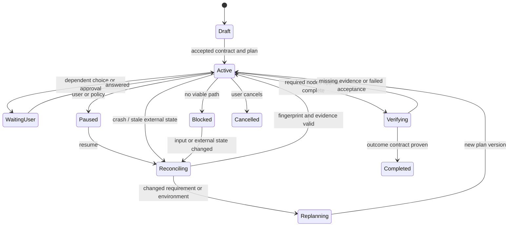
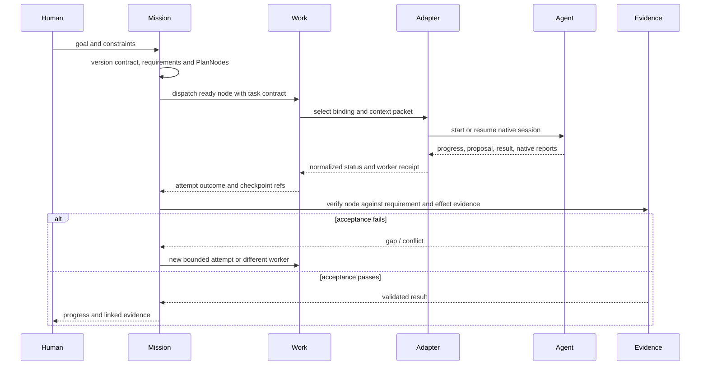
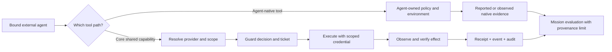
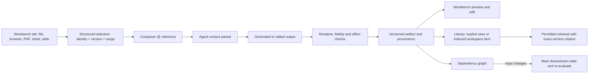
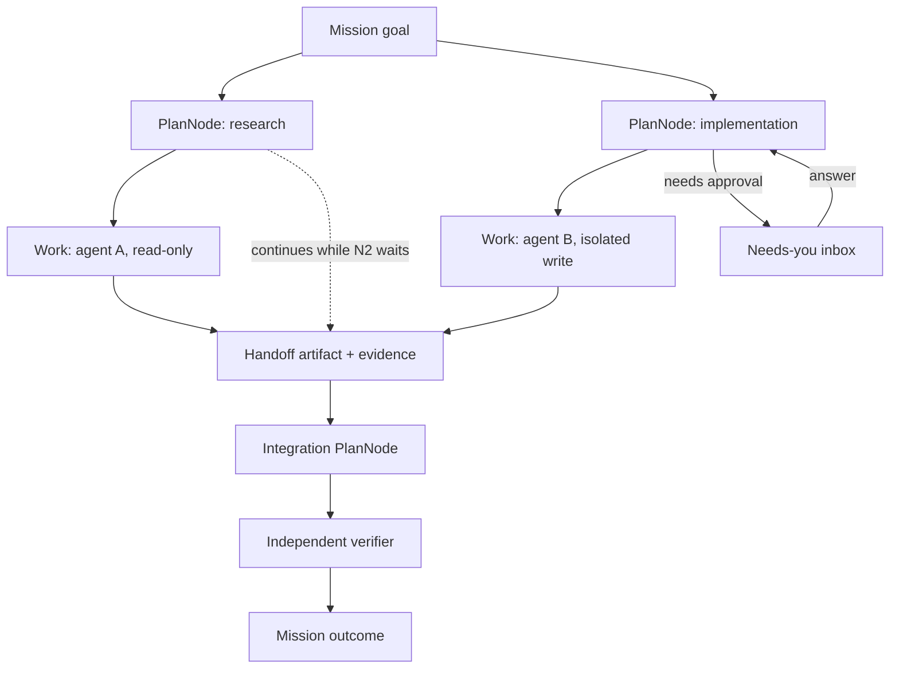
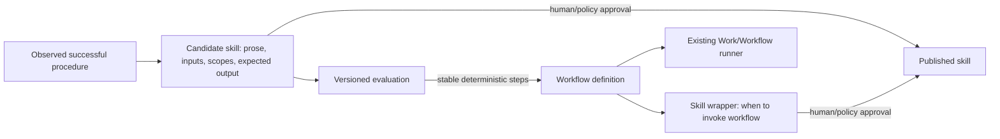
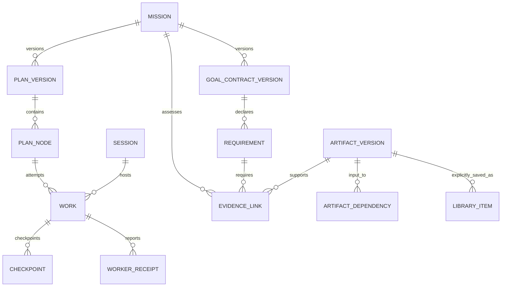
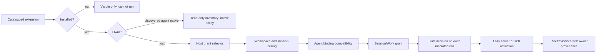
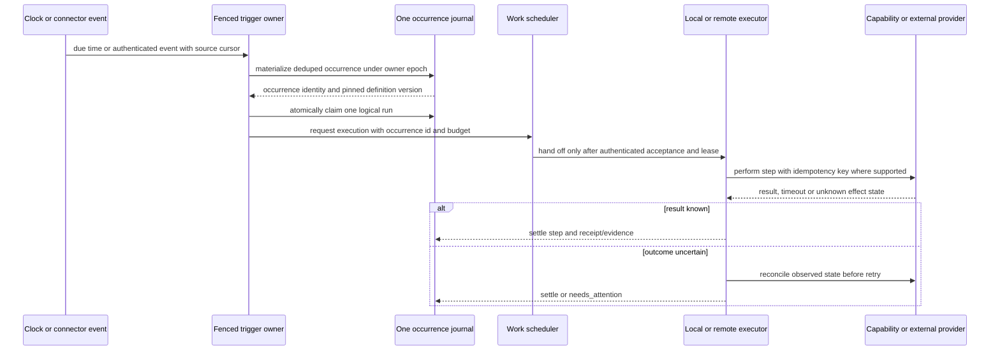

# 50 — System blueprint and ownership map

> Status: DEC-054/055/056/057/058 target architecture map. Mermaid diagrams are navigation and review aids; canonical fields/contracts remain in `06`/`07`, requirements in `08`, module details in `10`–`38` and `46`/`48`/`51`. Every arrow below denotes a named boundary, not an extra service. The target is a modular monolith with external adapters and one independently buildable local Observer, not a fleet of internal network microservices. Diagram labels `Core-mediated` and `agent-native` must stay distinct; occurrence ownership is fenced and does not imply exactly-once external effects.

## 1. High-level ownership



**Boundary rule:** Mission owns durable intent, semantic PlanNodes and requirement/evidence truth. Work owns execution attempts and scheduling. The selected external agent owns its native turn, planning, tools, model and private config. Core owns only calls through its shared capability plane. A workflow is a version-pinned operational graph and can be invoked by a Mission; it does not own Mission planning. Model routing is separate from agent/harness selection. All cross-cutting state uses the existing event store and shared data model; no second event log or second reasoning engine is introduced.

## 2. Module-to-surface map

| Surface or user intent | Primary owner | Dependencies and output |
|---|---|---|
| Ordinary chat / renderer | Experience `48`, channels `32` | Agent binding `15`, context `16`, artifact cards `29`; no Mission required for bounded answer |
| Agent/model/access composer | Experience `48` | Agent discovery `46`, model capability `18`, effective policy `12`; unsupported choice disabled |
| Mission Control / team panel | Mission `35`–`36` | Work `11`, agents `15`, events `30`, evidence `34`; only observable native child state displayed |
| File tree / editing | Files `25` + Workbench `48` | World identity `21`, artifacts `29`, code `26`, office `22`, conflict/lease handling |
| Browser / desktop view | Browser `23`, computer `24` | Managed execution `19`, Trust `12`, effect verification `34`, takeover resnapshot |
| Office/PDF/media preview | Office `22`, artifacts `29` | Render/fidelity providers and native fallback; preview is not equivalent to lossless edit |
| Library / retrieval | Artifacts `29`, files `25`, search `27` | Versioned extraction/indexing, permissions `12`, context `16`, world links `21` |
| Connected apps | Comms `28`, providers `14` | Vault `12`, capability `13`, optional MCP; API preferred to browser/desktop |
| Workflow/skill conversion | Workflow `20`, lifecycle `37`, extensions `31` | Work `11`, approvals `12`, versions/evals; no silent publish |
| Settings / agent inventory | Experience `48`, ecosystem `46` | Read-only discovery, native-vs-host extension scope, credentials owner, health and capability probes |
| System Workbench / machine data | Experience `48`, Observer `51` | In-app notice and consent, plain-language overview, provider/freshness status; no implicit chat-context injection |

## 3. Durable Mission and replaceable workers





An agent-native subagent is not automatically a host Work child. Host delegation produces a PlanNode/Work attempt and explicit child contract; native child telemetry is an agent report unless independently observed. Failure of a Work attempt does not fail the Mission. Replacing an agent reconstructs context from durable state and reconciles execution environment before new side effects.

## 4. Governed and native effect paths



The hierarchy API/native connector → MCP → structured browser → visual browser → desktop is a **selection preference when all are available and authorized**, not a mandate to intercept a discovered agent's private tools. A shared MCP catalog item is not globally mounted. Scope is resolved for each agent/session/workspace/Mission, and unsupported overlays fail closed with an honest status. Native effects cannot inherit a Core receipt or verification badge.

## 4.1 Local machine observation and optional elevation

```mermaid
sequenceDiagram
  actor User
  participant UI as Workbench / Settings
  participant Core as Core Capability + Trust
  participant Runtime as Runtime supervisor
  participant Observer as Normal-user Machine Observer
  participant Store as Bounded local sample store
  participant Priv as Allowlisted privileged provider
  participant UAC as Windows UAC
  participant Helper as One-shot typed helper
  participant Events as Existing Core event store
  User->>UI: Open System or request a machine reading
  UI->>User: Explain category, purpose, recipient, sampling and retention
  alt User enables this scope
    User->>UI: Explicitly enable selected scope
    UI->>Core: Request named metric/query with actor, Work and grant identity
    Core->>Core: Trust validates current consent and capability scope
    Core->>Runtime: Start/lease Observer at normal-user privilege
    Runtime->>Observer: Authenticated versioned local IPC
    Observer->>Observer: Read supported standard-user providers
    Observer->>Store: Persist only separately opted-in bounded history
    Observer-->>Core: Typed values + source + time + freshness/status
    Core-->>UI: Plain-language view; agent projection only if separately authorized
    opt Exact requested provider reports elevation required
      UI->>User: Show shield-marked exact read and standard-access fallback
      User->>UI: Choose Read this detail once
      UI->>Core: Authorize one exact operation
      Core->>Runtime: Launch signed helper with one-operation grant
      Runtime->>UAC: Request elevation for this helper operation
      UAC->>Helper: Start helper after OS approval
      Helper->>Priv: Perform one typed read
      Priv-->>Helper: One bounded result
      Helper-->>Core: Result, provenance and correlation id
      Helper->>Helper: Exit immediately
      opt Separate history consent covers this result
        Core->>Observer: Store this one result under normal-user privilege
      end
      opt User denies or cancels UAC
        UAC-->>Core: No elevation grant
        Core-->>UI: permission_needed; standard readings remain available
        UI-->>User: One contextual explanation; no automatic retry
      end
    end
    Core->>Events: Publish scope/config/health/alert transition only
  else User chooses Not now
    UI-->>User: Collect nothing; show one inline Enable / Keep off explanation
  end
  Note over Store,Events: Samples/history stay in the Observer store; never mirror each poll as a Core event
  Note over UI,UAC: Observer adds no install privilege requirement. NSIS is per-user; MSI install-scope UAC, if any, is install-only and never data consent.
```

The split is intentional: product consent authorizes collection/data scope; OS elevation authorizes a specific operating-system operation. Both must pass independently. Declining product consent means no sample is taken; declining UAC is a normal partial-capability result, not a reason to relaunch or elevate the application.

## 5. User selection, artifacts and Library



Renderer support and editing fidelity are independently probed. PDF, Office and arbitrary MIME entry points may use read-only preview or a native-app fallback. Retrieval never promotes uploaded content into trusted instructions. Closing a preview does not close or cancel its producing Work.

## 6. Team, workflow and human coordination





Parallelism is bounded by independence, isolation, agent limits and expected integration cost. A “swarm” is a scheduling policy over existing Work, not a separate agent framework. One lead can delegate to heterogeneous agents only through supported bindings, task contracts and scoped artifacts. Human questions block only dependent nodes; approvals always apply to the exact proposed action/version.

## 7. Viability and unresolved implementation probes

### 7.1 Durable data relationships



Mission, PlanNode and Requirement are semantic truth; Work and Session are execution attempts. Artifact versions, receipts and evidence links are distinct records. A workflow definition can be invoked by a PlanNode through one Work, while its internal versioned nodes remain Workflow-owned (`06`, `35`–`37`).

### 7.2 Effective extension scope



Catalog, installation, availability and activation are separate states. The UI resolves one effective row per extension and explains a collision, missing bridge, expired credential or revocation before a user relies on it (`31`, `46`, `48`).

### 7.3 Scheduled and event-triggered ownership



The trigger owner transfers only with definition/version, occurrence journal, source cursor and a fencing epoch. An accepted remote Work lease alone does not transfer future schedules. The old owner stops materializing before the successor claims; after an uncertain handoff, both sides reconcile the journal before creating another occurrence (`19`, `20`, DEC-057).

### 7.4 Probes that remain

The blueprint is viable as ownership design, but the following cannot be asserted as shipped or universally available: external-agent session resume/steering/model picker, native child telemetry, injected shared MCP/skill support, Chrome user-profile attachment, lossless Office editing, every filetype preview, cloud continuation and strong local-model task performance. Each requires capability negotiation, adapter-specific probe, user-visible fallback and benchmark evidence. The right Workbench's managed Chromium surface may be implemented through a supported browser bridge rather than direct browser embedding; UI design must not assume one renderer API. Windows desktop control needs display/focus/permission probes and verified effect receipts for Core-mediated actions. Multi-agent quality requires integration and independent outcome checks, not mere process count. `39` owns implementation dependencies; `49` owns scenario oracles.
