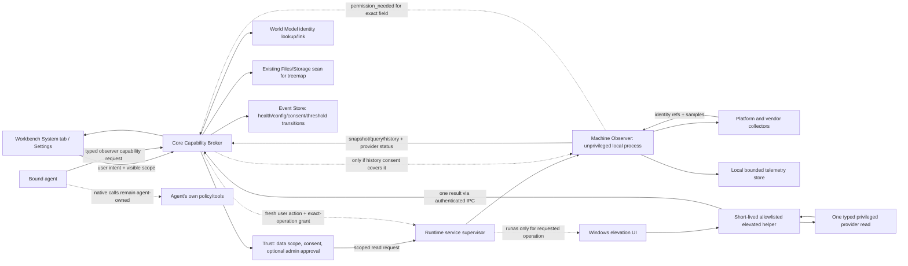

# 51 — Machine Observer: system health, hardware and local runtime telemetry

> **Status:** DEC-058 target architecture, 2026-09-28; implementation pending. This is a product capability and an independently buildable local service, not an expansion of the World Model. Requirements are `REQ-OBS-*` in `08`; the friendly Workbench surface is `48` §5 and `REQ-UXQ-011`; source evidence and exact reviewed paths are in `45`/`44`; tasks are `TODO.md` W6.
> **Purpose:** let a person understand their own computer and let an authorized agent answer bounded machine-state questions, without elevating the whole application, silently collecting, or turning this into a remote management tool.
> **Dependencies:** `12` Trust · `13` Capability · `19` Runtime · `21` World Model · `25` Files/Storage · `30` Events · `48` Experience. **Consumers:** local-user dashboard, Core capability calls, local-model diagnostics, authorized agent Work.

## 1. Decision and product boundary

Build one small, read-only **Machine Observer** service that can ship inside AgentCowork and later build/run from its own source subtree as a standalone laptop monitor. Its service boundary is justified by OS/provider isolation, bounded background sampling and future extraction. It is not a microservice fleet, a new workflow engine, a new scheduler, or a second event log.

The service observes the local host. It does not change settings, kill/suspend processes, install drivers, repair disks, open files, inspect prompts, or execute arbitrary user-supplied commands. Core decides which observer capability a user or agent can access. An external agent's own tools remain its own; it receives Machine Observer data only through an explicit Core capability grant and a scoped projection.

The standalone build has an interactive local-owner consent path. Only AgentCowork integration calls can receive agent/Work context through Core. The standalone build must present its own local-owner notice/consent before sampling; that local consent is never accepted as agent authorization.

**World Model (`21`) owns identity and relationships** such as a process identity `(pid, start_time)`, device identity, volume identity and freshness. **Machine Observer owns changing measurements and their bounded history**: CPU, memory, I/O, GPU, sensors, disk-health observations and local-runtime activity. World Model may link to a sample stream; it does not store or query time-series data. The existing Files/Storage owner remains responsible for file-tree scans and treemaps.

## 2. Product capabilities

| Capability | Product behavior | Boundary / honest limit |
|---|---|---|
| Live system overview | CPU load, memory/commit, storage space, disk/network throughput and collector health; optional process summary or sensor/GPU details only when their separate categories are enabled | Fields are independently available; values carry unit, source and observation time. |
| Process explorer | Sort/filter process CPU, memory, I/O and supported GPU use; link process to World Model identity | No process control. Command lines, environment, raw handle/object details and loaded-module metadata are off by default and require a separately named advanced scope. PID alone is never a durable identity. |
| Advanced process diagnostics | On-demand process owner/image/parent, thread summary, handle count, service status and supported module metadata | Separate consent; request the minimum OS access rights for each field. Protected or inaccessible processes return a typed gap. No memory read, handle duplication, command-line/environment collection, open-file-path listing, stack capture, or continuous diagnostic history in this baseline. |
| Hardware and GPU | CPU/device model, temperature/fan/power/clocks where provider exposes them, GPU engine/memory/process use | Provider, OS, model and driver determine coverage. Report `unsupported` or `permission_needed`; never synthesize missing sensors. |
| Storage | Volume capacity/usage, read-only SMART health where supported, and an on-demand file treemap | Reuse current `agentcowork-storage` scanning/treemap through Core; do not create a second file walker. SMART read-only support is per device/driver. No disk self-test, benchmark, repair or write. |
| History | Local charts and “what changed?” summaries over opted-in sample history | Bounded, local retention; high-frequency samples are not inserted one-by-one into the Core event log. Process identity/name history is a separate opt-in. |
| Query my machine | Natural-language requests resolve to a typed, read-only query plan; Advanced may offer SQL-like queries over an allowlisted OS table set | No arbitrary SQL extensions, shell, writes, control tables or unbounded scans. Optional osquery provider can supply mature tables after compatibility and security qualification. |
| Local-model activity | Attribute model runtime CPU/GPU/memory when the process identity can be correlated; ingest metrics from a configured local server when it supports them | Never infer tokens/sec, KV-cache, request counts or model quality from GPU load. Runtime-reported metrics are labeled separately from OS-observed metrics. Prompts and completions are never collected. |
| WSL | Show host-visible WSL resources and, when selected, per-distro process/Linux metrics | Per-distro detail is an opt-in connection. Do not start a stopped distro, install an agent/helper, or enter its filesystem in the background. Metrics have documented driver/kernel limits. |

## 3. System shape and ownership



**Process layout:** one normal-user observer executable, supervised by existing Runtime `19`; platform/vendor collectors are modules in that process and can fail independently. On Windows, a distinct minimal elevated helper exists only if a selected operation genuinely needs it. The desktop shell and Core remain `asInvoker`. The helper accepts a closed set of typed read operations, never arbitrary paths/commands, handles one user-requested read and exits. Linux/macOS use their native permission model and the same per-capability disclosure; do not display Windows UAC language on other platforms.

**Extraction seam:** put the portable service host and its protocol under `services/machine-observer/`, with its own manifest, entry point, protocol version, storage schema, docs and tests. It must not import AgentCowork internal crates or UI types. Core owns only a client/adapter that maps service observations into `13` capability results and `21` World identity refs. Keep the wire contract and service policy portable; OS-specific providers sit behind interfaces in the service subtree. The standalone build must work without the Tauri app. This is one service with modules, not a set of network services.

## 4. Collector and provider strategy

| Area | Preferred starting point | Fallback / limitation |
|---|---|---|
| Process, CPU and memory on Windows | Native Windows counters/APIs; System Informer is a reference for process snapshots, deferred enrichment and separating a helper | `sysinfo` can cover cross-platform basics; do not inherit process-control, kernel driver or stack-trace features. Advanced fields use a separate on-demand scope and minimum field rights; only a provider-proven privilege gap may invoke the one-shot helper. |
| Hardware sensors | Provider interface modeled around typed sensor kind/value/unit/status; evaluate LibreHardwareMonitor adapters for Windows and vendor libraries where they fit packaging | A provider/driver missing or blocked means an honest partial result. Do not require a sensor driver for the base dashboard. |
| GPU on Windows | Windows GPU Engine/Adapter/Process counters, then available vendor provider | NVIDIA NVML, AMD SMI and Intel/vendor APIs differ by OS, GPU generation, driver and virtualization. Probe each metric; no single API covers every combination. |
| GPU on Linux/macOS | Platform adapter plus supported vendor libraries (e.g. NVML / AMD SMI / platform GPU counters) | Keep per-OS providers isolated. Package only when the license, ABI, redistributables, privilege and update burden are acceptable. |
| Disk/volume capacity | Existing cross-platform `sysinfo`/OS mount APIs; correlate to stable volume identity | This is instantaneous machine telemetry, distinct from directory-level storage scans. |
| Directory space map | Existing `agentcowork-storage` / `storage_scan` capability (WinDirStat is a scan/progress/treemap reference) | On-demand only, cancellable and scoped. Do not duplicate its walker in Machine Observer. |
| Disk health | Read-only SMART provider behind a capability probe; smartmontools is a behavior/provider reference | Device passthrough differs. Do not run destructive self-tests or silently install drivers. |
| Queryable OS tables | Typed query plan over a minimal curated set; optional osquery integration for mature OS tables | Keep query read-only, allowlisted, bounded by time/rows and pre-authorized. Do not create a second schema of ad hoc SQL tables in Core. |
| Network | Per-interface byte/rate and connection metadata where supported | No packet capture/content collection in the base monitor; deep tracing is a separate future opt-in. |
| History | Service-owned local SQLite series with retention and downsampling | No embedded Prometheus/Grafana stack or public HTTP listener. Optional loopback metrics export is a later explicit feature. |
| WSL | Host-level process and adapter view first; a distro provider only after user chooses a distro | WSL GPU and process queries can be incomplete; do not claim parity from host GPU visibility. Never auto-start WSL. |

The provider registry returns a metric descriptor before sampling: stable metric id, unit, sensitivity, current support state, source/provider version, observed time, permission required, refresh interval and a user-readable failure reason. States are `available`, `stale`, `unsupported`, `permission_needed`, `disabled`, `temporarily_unavailable`, or `error`. A provider's existence does not imply a metric is available.

## 5. Sampling, history and local-model attribution

**Live mode:** refresh visible dashboards at a bounded, user-configurable cadence; pause high-cost collectors when the view is closed unless the user explicitly enabled history. **History mode:** user explicitly chooses collection categories and retention. Initial target: keep 24 hours of high-resolution basic resource samples and 30 days of one-minute rollups; calibrate CPU, disk, SQLite growth and battery impact on representative Windows hardware before freezing. Keep process-name/PID history disabled by default and separately consented. Show collection status and stop/purge controls.

The observer's sample store is local and bounded. It is not the event log. `30` receives only lifecycle/configuration/consent changes, health transitions, collector gaps and configured threshold alerts with references; high-rate sample payloads stay in the observer store. Mission/task evidence stores references plus requested snapshots, not an unbounded stream.

Local-model association follows this order: (1) AgentCowork-owned runtime emits a run-scoped metric with `run_id` and process generation; (2) configured local inference server exposes an authenticated/loopback metrics endpoint; (3) OS process/GPU observations are correlated by `(pid, start_time)` and labeled approximate. A remote or opaque external agent may only expose its own counters; AgentCowork must not inspect its prompts, local files or private session state. No collector should automatically enable a server's HTTP metrics endpoint.

A sample is never described as causal proof. If a GPU provider reports device utilization but not per-process attribution, show only device utilization. If a runtime reports generated tokens/sec, preserve the runtime as source and its measurement window; do not call the device load itself inference throughput.

## 6. Permission model and admin notification

Do not make Machine Observer a reason to elevate the installer, install a privileged service/driver, or run the application as administrator. The consumer NSIS route is configured for a per-user install. This repo pins Tauri CLI `2.11.4`; its generated WiX template sets `InstallScope="perMachine"`, and the repo does not override that template. Label the MSI as an administrator-managed, machine-wide installation; its UAC applies only to installation. NSIS is the no-admin default consumer path. Any installer approval applies only to placing the application at the selected install scope; it never enables telemetry. Monitoring remains useful without elevation. A separate OS privilege request is deferred until a user requests a specific optional reading that its probed provider cannot deliver otherwise.

There are three independent decisions; none implies either of the others:

The first-use notice applies to the whole System observation surface, including basic CPU/memory readings; detailed categories below need their own grants. Consent is a product-level disclosure and can be revoked in settings. It must never be described as an OS permission or as Windows administrator approval. If the user chooses Not now, no sample is collected; the System tab stays usable as an explanation and displays one contextual inline note about the optional local overview, with Enable / Keep off. After Keep off or dismissal, do not repeat unless the user explicitly reopens the permission control.

Suggested first-use copy: “See how your computer is doing. AgentCowork reads basic performance values and keeps any history you enable on this device. Nothing is shared with your agent unless you separately allow it for a task. You can change this in Privacy & permissions.” Actions: **Enable local overview** / **Not now**. After declining, the single inline follow-up says what is unavailable and offers **Enable** / **Keep off**; it does not block chat or other work.

| Scope | Examples | Default |
|---|---|---|
| Basic system status | CPU/memory load, volume capacity, network byte rates, device summary | Show notice before first read; user explicitly enables local overview |
| Process summary | process name, PID generation, CPU/memory/I/O and supported GPU usage | Separate consent; history separately off by default |
| Advanced process diagnostics | owner/image/parent, thread summary, handle count, service state and supported module metadata | Separate on-demand consent; no history by default; inaccessible/protected processes are reported, never bypassed |
| Highly sensitive process internals | command line, environment, handle duplication/object paths, memory contents, open-file paths, stack capture | Not collected in this baseline; requires a separate product/security decision and exact data scope |
| Network metadata | connection endpoints/process association, never packet content | Separate consent; no connection history unless enabled |
| Hardware details | sensor, temperature, power, fan, SMART health | Category consent; per-provider and platform gaps displayed |
| History | time series, process identity/name history, thresholds | Separate category and retention; process history off by default |
| WSL | selected distro status and metrics | Explicit per-distro opt-in; never start a stopped distro |

1. **Data-access notice and consent** — AgentCowork tells the user what category will be read, which scope, why, collection cadence, local retention and whether an agent will receive the result. This is required even for read-only access to process, network, device or history data. It is recorded through the single Trust owner `12`; consent is per category/scope and may be revoked. A first-use explanation is not a claim that the OS has granted privileges.
2. **OS elevation or platform permission** — requested only when the exact collector reports that it needs an OS privilege. The exact field/action is labeled with the Windows UAC shield and names the read and why before the user activates it; Windows then displays its own UAC consent/credential UI. The application itself is never relaunched elevated. On denial/cancel, keep ordinary metrics working and mark that collector `permission_needed`.
3. **Agent/Work disclosure** — local dashboard consent never exposes readings to an agent. A user must separately grant the exact Machine Observer capability and fields to a specific Work/session through Core and Trust. An external agent's native tools or local permissions do not count as this grant; native activity remains under the agent's own policy and provenance.

The permission surface itself identifies the exact field, the one-time read, why standard access cannot provide it, and the standard-access fallback. Its action is **Read [detail] once** with the OS UAC shield; activating that action proceeds directly to Windows' own consent/credential UI, without a second AgentCowork confirmation dialog. A standard Windows account may need an administrator's credentials; the user can cancel and continue with standard access. After denial/cancel, one non-modal, non-error explanation says which detail remains unavailable and that the overview still works, with **Try this read once** / **Keep standard access**. “Try this read once” is a new user action and may invoke UAC once; no retry happens automatically. Example: “Administrator approval is needed only for this protected detail. The CPU, memory and storage overview still works without it.” After cancellation: “Standard access is still on. AgentCowork could not read [detail]. You can try this one read again or keep standard access.”

Do not ask the user to “grant admin to monitor everything.” Most read-only metrics should run under the user token; access depends on the API/device/OS. Advanced process internals, some device paths and certain SMART passthrough operations may need privileges, while the same category can be accessible without them on another host. Determine this from provider probing, not a global assumption. Never show a UAC prompt at startup, during background polling, or after a denied request without a new user action.

For a helper, use an authenticated per-user IPC channel (Windows named pipe ACL; Unix-domain socket permissions on supported POSIX hosts), protocol version, strict message-size/time limits, closed operation enum and explicit grant expiry. The helper cannot launch subprocesses, write files/settings, access arbitrary paths, control processes, install a driver or accept a raw query. Its process and grant exist for one user-requested operation only, then exit; there is no elevated session or sampling loop. Standard-user denial degrades cleanly. No hidden always-on admin service is part of the default product.

DEC-058 tightens this helper rule: it is launched only after consent and an actual provider need, handles one enumerated read request, returns the result and exits. It never samples in the background at elevated privilege. A metric unavailable to the standard-user observer stays permission_needed until the user explicitly requests that exact read again; denial does not trigger another UAC prompt without a new user action.

If the user declines UAC, show one contextual in-panel follow-up (not an error modal or a second approval prompt) that explains which reading remains unavailable and what that exact read adds. Offer “Try this read once” and “Keep standard access”; persist dismissal for that scope as non-authoritative UI preference only, and do not repeat it during polling or future launches. An explicit later attempt is new intent and may show UAC again; no dismissal preference grants access. Keep the feature usable at standard-user privilege. This is product guidance after a denied OS prompt, not another OS prompt.

## 7. Query, capability and privacy contract

An agent asks for a semantic operation such as `machine.snapshot`, `process.top`, `gpu.summary`, `storage.health`, `storage.analyze`, `machine.query`, or `machine.history`. The Core capability descriptor states data classes, scope, sensitivity, freshness, side effects (read-only), required consent and optional OS permissions. Trust authorizes access before Core calls the observer. Query results are bounded and returned with provenance, source, units, timestamps, support gaps and stable World refs; natural-language synthesis remains the bound agent's job.

The query planner accepts structured table, columns, filters, ordering, time range and limit. If an Advanced SQL editor is offered, it compiles only a parsed read-only `SELECT` over an allowlist, blocks multi-statements, virtual tables/extensions with side effects, file/network functions, PRAGMA, ATTACH and arbitrary functions, and enforces query timeout/result limits. Every query returns its normalized plan and visible scope. Query text and results are not sent to cloud models unless the user explicitly includes them in that Work's context under the existing data policy.

Process diagnostics use an explicit `process.diagnostics` category and a closed field allowlist. Ask the OS only for the minimum access rights needed for each requested field; never request `PROCESS_ALL_ACCESS`, duplicate process handles, or read process memory. Protected/inaccessible processes produce a field-level status, not a privilege bypass. Diagnostic details are on-demand and not retained unless the user separately enables history for that category. Command lines, environment, open-file paths, stack capture and kernel/driver tracing remain outside this baseline.

Default data is metadata only. Never collect process command lines, environment variables, open-file paths, network payloads, keystrokes, screenshots, file contents, prompt/completion text, or credentials. These fields are omitted from normal adapters; adding any later requires a new explicit capability/sensitivity review and user-visible scope.

## 8. Right Workbench and settings

Add a **System** tab to the right Workbench with a nontechnical default Overview: “Your computer now” cards for CPU, memory, storage, network and GPU when available; a short time-range chart; local-model activity when attributable; health/permission badges; and one-click open actions. The page explains partial readings in plain language. It must not expose SQL, kernel tracing, sensor IDs or raw process internals by default.

Advanced drill-down tabs: Processes, Hardware & GPU, Storage, Network, History, Query. The Storage page composes live volume/SMART observations with the existing Files/Storage treemap and marks which path scopes were scanned. Settings adds System Monitoring controls under Privacy & permissions and Diagnostics: category grants, history/retention, sampling cadence, per-provider health, platform limitations, WSL distro opt-in, elevated helper status, revoke and delete-history. The user's current request/selection can attach a timestamped observation ref to chat; the agent gets only the authorized fields. Opening the System panel does not automatically send metrics to the current agent.

## 9. Safety, cost and failure behavior

- Read-only means no OS mutation; a directory scan may consume I/O, so it is cancellable, bounded, visibly active and uses the existing storage scanner.
- Enforce maximum sample cadence, process count, history bytes, query time/result count and concurrent scans. When resource pressure or battery policy requires throttling, report the sampling gap.
- Sampling failures never become zero values. Preserve last observation plus age and explicit degraded status.
- Unknown/missing sensors, WSL partial support, denied device access and stale counters remain individually visible.
- A helper crash/IPC timeout terminates the helper, marks the affected fields unavailable, and leaves the app/service at normal privilege.
- SMART/provider tools are read-only; no self-test, benchmark, secure erase, trim, firmware action or disk repair is exposed.
- No eBPF/kernel tracing in the initial service. It requires signed kernel components, larger attack surface, platform/driver qualification and expert opt-in; basic dashboard/process/GPU visibility does not depend on it.
- Process names/PIDs and device identifiers are local personal data. Retention, export and deletion are visible; crash/support bundles exclude samples unless the user previews and explicitly includes them.

## 10. Versioned service protocol (LLD)

The protocol is transport-neutral and versioned; local transport is a current-user named pipe on Windows and a permissioned Unix-domain socket on POSIX. It exposes no TCP/HTTP listener by default.

```text
ObserverHello(protocol_min, protocol_max, app_instance, requested_scopes)
  -> ServiceHello(protocol_version, service_version, host, provider_descriptors[])

GetSnapshot(scope, metric_ids[], max_age_ms)
  -> Snapshot(observed_at, entries[], provider_status[])

Query(typed_plan, result_limit, timeout_ms)
  -> QueryResult(normalized_plan, rows[], observed_at, omitted_fields[], provider_status[])

GetHistory(metric_ids[], entity_refs[], from, to, max_points)
  -> HistorySeries(series[], retention_status)

StartSampling(profile_id, categories[], cadence, retention, grant_ref)
  -> SamplingHandle(status, next_sample_at)

StopSampling(handle) / RevokeScope(grant_ref)
  -> ServiceStatus

Health() / Shutdown(reason)
  -> HealthReport / acknowledgement
```

Requests are actor/work scoped by Core and include a correlation id, not a secret. The observer validates requested scopes against its locally held startup lease; it never treats a caller-supplied `permissions` field as authority. Telemetry records use append/rollup and do not expose direct DB handles. Any protocol error returns a typed status and no partial value without a staleness marker.

## 11. Current code reuse and migration ownership

The repository already has useful pieces, so the new service must converge rather than duplicate them:

| Existing code | Current capability | Target disposition |
|---|---|---|
| `crates/agentcowork-core/src/models/probe.rs` `probe_hardware` | One-shot CPU/RAM/free-space/NVIDIA VRAM probe used for local-model fit; process/runtime discovery | Move host observation behind the service adapter when service is introduced; preserve the current model-fit contract through a Core projection. Fix platform-specific coverage as part of that migration. |
| `src-tauri/src/storage_cmds.rs` `storage_health` / `storage_scan`; `crates/agentcowork-storage` | Volume health and cancellable directory scan/treemap | Keep the existing scanner as the sole file-tree/storage-scan implementation; compose its output in the System tab. Route volume snapshot/SMART under observer capability where appropriate without double-walking. |
| `packages/core-ai/src/metrics/metrics-collector.ts` | Request/route metrics for app's AI calls, including token latency and speed | Retain as model-runtime metrics source; bridge only approved aggregate/run-scoped fields to local history. Do not merge prompt hashes, raw request fields or external-provider data into machine telemetry by default. |
| `crates/agentcowork-core/src/rss_measure.rs` | AgentCowork process memory measurement | Keep internal runtime diagnostics; optionally expose only app-process aggregate in the System tab. It is not a machine-wide collector. |
| `crates/agentcowork-core/src/wsl.rs`, `src-tauri/src/acp_cmds.rs` | WSL path/runtime discovery and execution adapter | Do not reuse its agent-discovery behavior as permission for monitoring; implement explicit distro selection and no-start semantics for observer access. |

No files should be deleted as part of the architecture task. During implementation, migrate each overlapping call site behind the adapter, prove parity, then retire an old path only when no callers remain.

## 12. Acceptance and open probes

This architecture is viable as a single Rust service with OS/vendor adapters, but sensor parity, Windows packaging, UAC helper signing, battery overhead and SMART passthrough must be demonstrated on real devices. Qualification records exact OS build, hardware, driver, permissions and provider versions. Required scenarios are `TC-040…050` in `49`; failure paths include unsupported/stale sensors, consent or admin denial, protected/inaccessible processes, helper crash, corrupted/full telemetry DB, sleep/wake, very large process lists, WSL not running, WSL provider mismatch, local server without metrics, workload attribution ambiguity, and retention cleanup while queries are active.

Open probes before implementation:
1. Which cross-platform process/system library and native APIs meet freshness/overhead targets on Windows 11, macOS and Linux without bundling an always-on privileged driver?
2. Which Windows GPU counters have acceptable per-process attribution and overhead across WDDM/driver versions?
3. Can the chosen Rust hardware abstraction package cleanly without .NET runtime, ring-0 driver install or unwanted redistributables? If not, keep it optional and choose OS/vendor adapters.
4. SMART read access matrix for NVMe/SATA/USB bridge on supported Windows builds; validate before promising drive health.
5. Whether to ship an osquery adapter, invoke an installed osquery service, or keep the first release on curated typed query templates; compare packaging, query-surface exposure and performance.
6. Local telemetry retention and sampling defaults after battery/storage measurement.
7. Exact elevated-helper install/update/signing and standard-user behavior per supported distribution channel.

## 13. Requirements pointer

Canonical behavior lives in `08` and maps in `09`. This table is navigation only.

| REQ | Behavior |
|---|---|
| `REQ-OBS-001` | Current typed read-only host snapshot and freshness |
| `REQ-OBS-002` | Per-metric/provider support, provenance, status and limitation |
| `REQ-OBS-003` | Data notice, scoped consent, least-privilege elevation and denial fallback |
| `REQ-OBS-004` | Bounded local history, retention and event separation |
| `REQ-OBS-005` | Safe typed/allowlisted query over OS facts |
| `REQ-OBS-006` | Disk capacity/health plus reuse of the single existing treemap scanner |
| `REQ-OBS-007` | Honest GPU and local-model telemetry attribution |
| `REQ-OBS-008` | Explicit WSL/distro selection and no silent start/install |
| `REQ-OBS-009` | Standalone service protocol and scoped Core integration |
| `REQ-OBS-010` | On-demand, least-rights process/service diagnostics with honest protected-process gaps |
| `REQ-UXQ-011` | Approachable System Workbench and point-of-use permission notice |

## 14. Research sources and source-use boundary

The pinned source paths and observed lessons are recorded in `ARCH/45-REFERENCE-RESEARCH.md` §Machine Observer, including System Informer, WinDirStat, Glances, osquery, windows_exporter, eBPF for Windows, smartmontools, btop, lsof and LibreHardwareMonitor. This architecture adopts patterns and interface lessons; no project source was copied. Upstream license files and exact pins are recorded in `44` §3. Recheck APIs, support and terms before selecting a binary/library dependency.
